# LoRA Dataset Studio

[](https://github.com/perfectgf/lora-dataset-studio/actions/workflows/ci.yml) [](https://discord.gg/j6hnJBFtXE) [](https://github.com/sponsors/perfectgf)

**Your whole LoRA pipeline in one self-hosted browser tab — build Character, Concept and Style datasets (generate from a reference, scrape, or triage a giant unsorted folder in the Image Bank), curate, caption, clean watermarks, then train locally or in the cloud across five model families and rank the checkpoints in a built-in Test Studio.**

🖥️ **Train locally** on your own NVIDIA GPU — or ☁️ **train in the cloud** on a rented pod (~$1–2 per run, no GPU required): same one-click flow, every epoch synced back to your machine. You can even bring your own custom base weights to either lane.

📑 **Not sure which settings to use?** Fifteen researched presets ship built-in — a Character, Style and Concept recipe for each family, sourced from Ostris' ai-toolkit defaults, vendor guidance and documented community consensus. One click applies the whole recipe.

The useful part of LoRA training isn't only the training — it's building a clean, varied, well-captioned image set. That job is normally scattered across a scraper, an image editor, a captioning script, and training configs. LoRA Dataset Studio puts the whole pipeline behind one UI: source a character from reference photos, import or scrape material for a concept or a style, triage a giant unsorted folder down to its keepers, curate and caption, scrub watermarks, train locally or in the cloud, then rank the resulting checkpoints in a test studio — without ever leaving the page.

<p align="center">
  
</p>
<p align="center"><em>One workspace for the whole route: a progress rail shows what's done, what's next and exactly what's blocking Train.<br>All screenshots in this README use a synthetic, AI-generated demo person — no real individual is depicted.</em></p>

---

## Everything it does

The big capabilities, each with what's actually inside it. Every block links down to its detailed section.

### 🎨 Build any dataset — Character, Concept or Style

<p align="center">
  
</p>

Four ways to fill a dataset, and one choice at creation that rewires everything downstream.

| Sub-feature | What it gets you |
| :-- | :-- |
| **Character / Concept / Style** | One choice at creation rewires captioning, masking and step-scaling — it isn't just a label |
| **✨ Generate from references** | Nano Banana Pro (Gemini), ChatGPT (`gpt-image-2`) or a local Klein/ComfyUI model, each request wrapped in identity-preservation instructions |
| **Variation catalog** | Character sets fan out expression / angle / lighting / framing / outfit / background without you writing a single prompt |
| **📥 Import your own** | Drag photos in — full frame for Concept/Style, optional auto head-crop for Character |
| **🌐 Scrape the web** | Reddit keyword search, Pexels via its official API, or a supported gallery / album / direct-media URL — straight into the open dataset |
| **✏️ Edit the prompt, regenerate** | Every generated tile reopens its exact prompt inline and re-renders through the same engine, identity guard included |

*Details: [1. Decide what you're teaching](#1-decide-what-youre-teaching) · [2. Fill it with images](#2-fill-it-with-images)*

### 🗃️ Image bank — a giant unsorted folder becomes a dataset

<p align="center">
  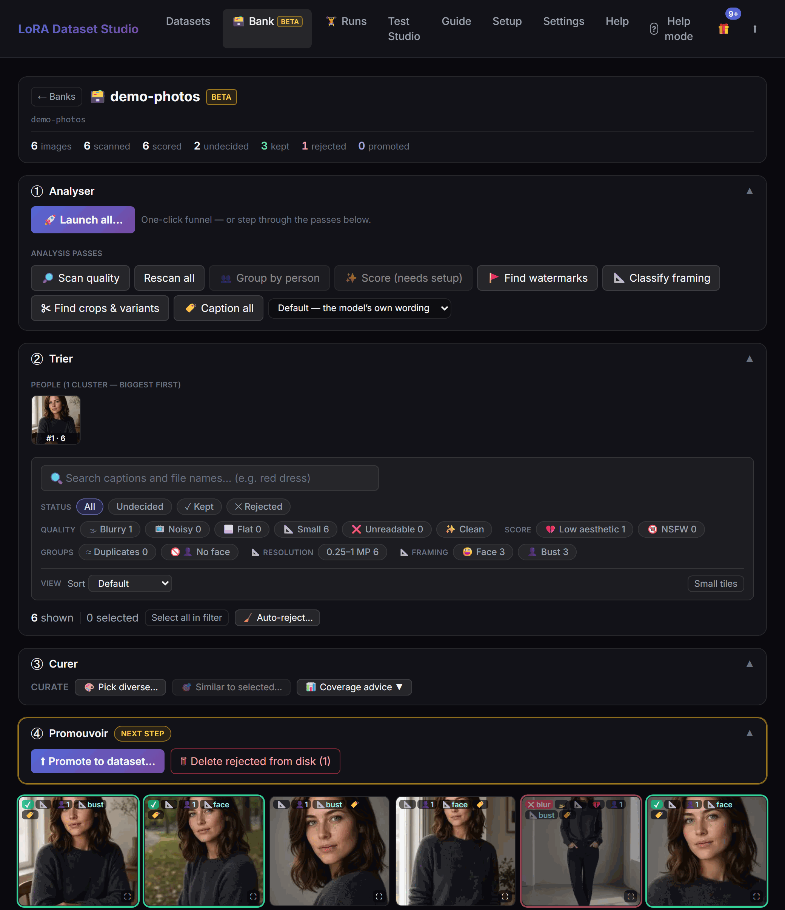
</p>

Point it at a messy dump of thousands of images and triage it in place — your source folder is never modified.

| Sub-feature | What it gets you |
| :-- | :-- |
| **Quality scan** | Flags 🌫 blurry, 📺 noisy, ⬜ flat and 📐 small shots, and groups ≈ near-duplicates with one **keep-best** click |
| **✨ Score** | A LAION aesthetic score, an NSFW probability and a 🎨 style grouping — one GPU pass, all three |
| **✂ Find crops & variants** | Catches the same shot re-cropped or re-compressed, reusing Score's embeddings (no extra GPU pass) |
| **🚩 Find watermarks** | A local vision pass flags overlaid logos/URLs/usernames with a stored bounding box |
| **👥 Group by person** | Clusters faces into people **with no reference photo needed**, GPU-accelerated when the card is free |
| **🔍 Search & filter** | Full-text search over captions plus Status / Quality / Score / Groups / Resolution filters with a live count |
| **🚀 Launch all** | Runs the whole chain end to end overnight and leaves a morning report |
| **④ Promote** | Pushes the keepers into a target dataset, resolving duplicate groups as you go |

*Details: [The Image bank](#the-image-bank--triage-a-giant-folder-in-place)*

### ✂️ Curate down to the keepers

<p align="center">
  
</p>

A grid built for real curation work, not a file explorer — with a numeric answer to "is this even the right person?".

| Sub-feature | What it gets you |
| :-- | :-- |
| **Grid actions** | Resize, zoom, crop or mirror a tile, then multi-select to Keep / Reject / Undecide, clear captions, delete, or Improve via Klein |
| **👤 Face-similarity scoring** | InsightFace scores every image against your reference and badges it green (strong) or orange (borderline) |
| **Auto-triage** | Applies a score threshold to undecided, scorable images — re-appliable, and a manual status change wins |
| **📐 Auto-framing badges** | A local vision model tags each image face / bust / body / back |
| **12 · 6 · 6 · 1 composition meter** | Tracks a Character set's framing mix against the target and names what's still missing |
| **Reload-proof batches** | Long server-side batches (captioning, face, framing, watermark) pick themselves back up after a page refresh |

*Details: [3. Curate down to the keepers](#3-curate-down-to-the-keepers)*

### 🏷️ Caption for the model

<p align="center">
  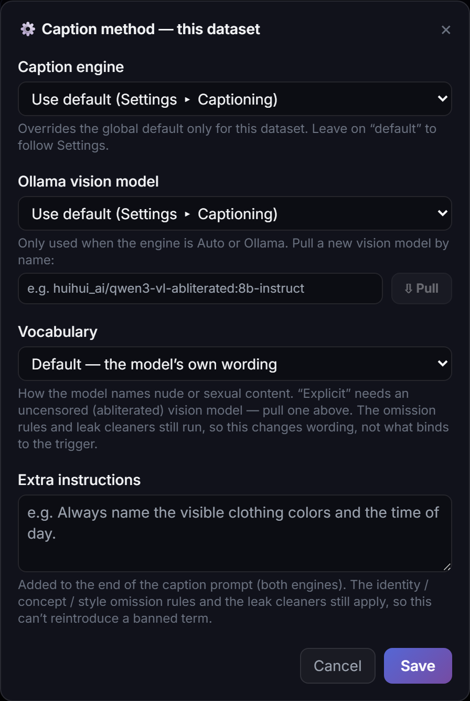
</p>

Captions are what training actually reads — written for you in the shape your base model wants.

| Sub-feature | What it gets you |
| :-- | :-- |
| **Model-matched form** | Prose for Z-Image / Krea 2 / FLUX.1 / FLUX.2 Klein, booru tags for SDXL — chosen from the target model |
| **Engines** | JoyCaption (via ai-toolkit) or an Ollama vision model, picked per dataset |
| **⚙️ Options** | Choose or **pull** the exact Ollama vision model and remember it on the dataset |
| **Vocabulary preset** | Explicit / Clinical / Safe naming of nudity, plus your own free-text wording instructions |
| **Kind-aware rules** | Concept captions invert and are leak-checked; Style requires a content-only caption per kept image |
| **Sweep the set** | Find/replace with frequencies, tag hide/isolate, an expanded editor, bulk caption clearing |
| **Dual captions (long + short)** | Train each image on both wordings via ai-toolkit's `short_and_long_captions` (local training only) |

*Details: [4. Caption for the model](#4-caption-for-the-model)*

### 🧽 Scrub watermarks

<p align="center">
  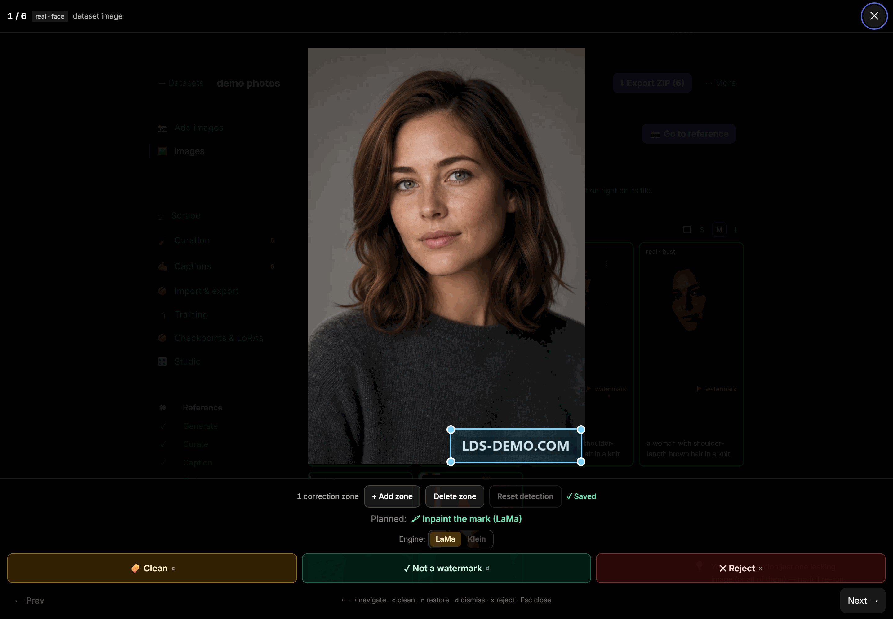
</p>

Left in, a site logo is something the LoRA learns. Find → Review → Clean, one image at a time.

| Sub-feature | What it gets you |
| :-- | :-- |
| **🧽 Find watermarks** | A local Qwen3-VL pass flags overlaid logos/URLs/usernames with a box — it deletes nothing |
| **Crop border marks** | A pure pixel crop that invents nothing and never cuts a side below 768 px |
| **Inpaint off-centre marks** | LaMa (fast, local) or the Klein engine (LaMa pre-fill + a FLUX.2 Klein refine pass, composited back in pixel space) |
| **🔍 Review flagged** | Step through each flag with its box drawn on the shot: clean it, dismiss a false positive, or reject the image |
| **`.orig` backup** | Every edited image keeps its watermarked original as a sibling file |

*Details: [5. Scrub watermarks](#5-scrub-watermarks)*

### 🎓 Guided training — local or cloud

<p align="center">
  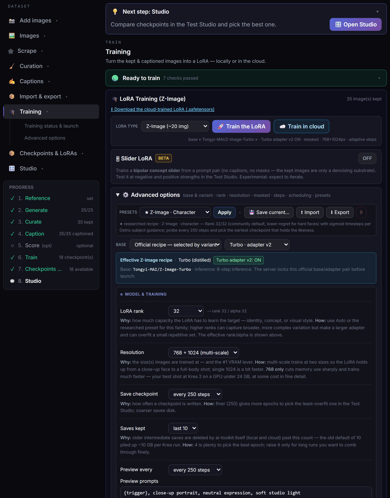
</p>

[ai-toolkit](https://github.com/ostris/ai-toolkit) runs underneath; the recommended path needs no config file.

| Sub-feature | What it gets you |
| :-- | :-- |
| **Five families** | Z-Image, SDXL, Krea 2, FLUX.1 and FLUX.2 Klein, each with its own safety checks |
| **Fifteen researched presets** | A Character, Style and Concept recipe per family, every value sourced with a one-line *why* |
| **Adaptive step policies** | Character ≈120 steps/image, Concept `475 × √images`, Style 50 steps/image inside a safe envelope |
| **Readiness & launch guards** | Image counts, untriaged rows, suspicious captions, duplicates, VRAM, disk and family compatibility, re-checked at launch |
| **⚙ Advanced controls** | Rank/alpha, resolution, LoRA or LoKr, dropout, timestep weighting, optimizer, scheduler, EMA, save/sample cadence |
| **Training queue** | Runs line up instead of colliding on the GPU, with a protected **Stop run** |
| **☁️ Cloud training** | Rent a vast.ai GPU (~$1–2/run, no local GPU), same exact config, pod terminated automatically |
| **Custom base weights** | Train on your own compatible base locally — or in the cloud via a one-time push to a private HF repo |
| **🎚 Slider LoRA (Beta)** | A bipolar LoRA whose ±strength dials a trait at inference, on a fixed 1000-step policy |
| **Masked training** | Character trains on auto-generated rembg person masks; Concept and Style force masking off |

*Details: [6. Train](#6-train--guided-advanced-when-you-need-it) · [No GPU? Train in the cloud](#no-gpu-train-in-the-cloud)*

### 🧬 Experiment Lab — the run family tree

<p align="center">
  
</p>

Every continuation and fork drawn as a lineage graph you can inspect, diff, annotate and act on.

| Sub-feature | What it gets you |
| :-- | :-- |
| **☰ List ↔ ◉ Graph** | A compact list or a left-to-right family tree with the path to the run you're viewing lit up |
| **Checkpoints as pills** | Each run shows its saved epochs, and a continuation's edge starts on the exact checkpoint it resumed from |
| **Inspect a run** | The exact settings it trained with — rank, alpha, LR, optimizer, timestep, base, EMA… |
| **Diff two runs** | Shift-click two nodes and compare their configs side by side, only the differences highlighted |
| **Notes** | Annotate any run or checkpoint (● marks the annotated ones) |
| **Per-checkpoint previews** | Same prompt, same seed, one preview per epoch — with a 🔍 big-preview grid to spot the sweet spot before it overcooks |
| **Act from a pill** | ⬇ download that epoch, 📦 import it into ComfyUI, or ▶ continue from here |
| **Honest reconstruction** | Older continuations reconnect automatically; runs whose files are gone are tagged, never invented |

*Details: [7. Read the family tree](#7-read-the-family-tree)*

### 🧪 Test Studio — pick the best checkpoint

<p align="center">
  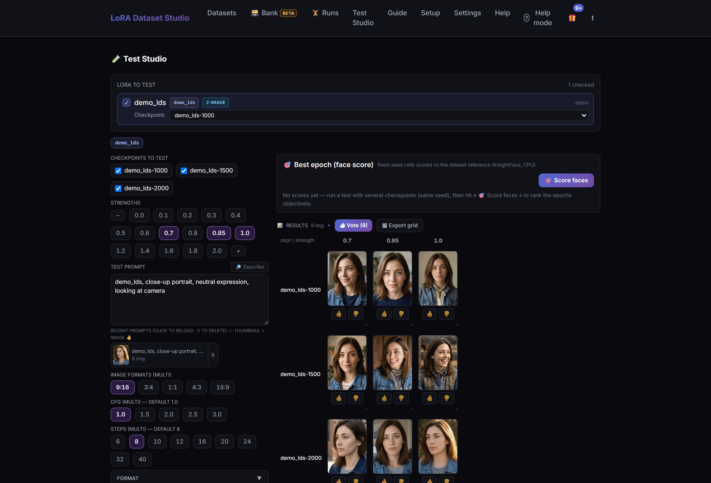
</p>

A LoRA that's *trained* isn't necessarily a LoRA that's *good*. Compare them on a fixed seed. (Z-Image, SDXL and Krea 2 today.)

| Sub-feature | What it gets you |
| :-- | :-- |
| **Checkpoint × strength sweep** | 0 → 2.0 by default, an over-cook range up to 4.0, and negative strengths down to −2.0 for slider LoRAs |
| **Multi-LoRA grids** | Select several LoRAs of the same family and compare them against strength |
| **🔎 Describe** | Drop any image and the local Ollama vision model turns it into a test prompt — never the identity or trigger |
| **Vote & rank** | Quick votes feed a Wilson ranking; Character results can also be ranked by face similarity |
| **Export the grid** | One labeled image ready to post — the composer works even with ComfyUI offline |
| **Flip in place** | Swipe, ‹ › buttons or arrow keys with wrap-around; strength variants sit adjacent |

*Details: [8. Pick the best checkpoint](#8-pick-the-best-checkpoint)*

### 📦 Take it with you

Nothing here locks your data in — every stage has an exit.

| Sub-feature | What it gets you |
| :-- | :-- |
| **Training ZIP** | Kept `image` + same-stem `.txt` pairs for ai-toolkit/Kohya, or sidecars written beside the images |
| **Merge existing data** | Import a training ZIP or recursively merge a local folder; perceptual duplicates are skipped |
| **💾 Back up everything** | Every dataset, its training history and your settings in one portable file (API keys excluded), Trained state restored |
| **Hugging Face publishing** | Publish kept images and captions as a dataset repository — private by default |
| **📦 Import into ComfyUI** | One click for local checkpoints; automatic for downloaded cloud results |
| **🗑 Trash** | Everything the app deletes lands there and stays recoverable until you empty it |

*Details: [9. Take it with you](#9-take-it-with-you)*

### 🖥️ Local & private, or ☁️ cloud

Same one-click flow either way, and every feature **degrades gracefully** — it stays hidden until its dependency (an API key, a reachable tool, an installed extra) is satisfied. See the [feature matrix by backend](#feature-matrix-by-backend) and [Run it your way](#run-it-your-way).

---

## The pipeline, at a glance

This README follows the app itself: the road you actually walk, from an empty dataset to a ranked, exported LoRA. Each stop below links to the section that details it — read top to bottom, or jump straight to the step you're on.

| Stop on the road | What you do there |
| :-- | :-- |
| **[1 · Decide what you're teaching](#1-decide-what-youre-teaching)** | Pick Character, Concept or Style — the choice rewires captioning, masking and step-scaling downstream. |
| **[2 · Fill it with images](#2-fill-it-with-images)** | Generate from references (3 engines), import your own, scrape the web, or triage a giant unsorted dump in the **Image bank**. |
| **[3 · Curate down to the keepers](#3-curate-down-to-the-keepers)** | Keep/reject on a real curation grid, with face-similarity scoring, auto-triage and a live composition meter. |
| **[4 · Caption for the model](#4-caption-for-the-model)** | Prose or booru tags, model-matched and machine-written, with a Vocabulary preset, a Caption Lab and full find/replace. |
| **[5 · Scrub watermarks](#5-scrub-watermarks)** | Find overlaid logos/URLs, then crop or inpaint them (fast LaMa or Klein quality) behind a review step. |
| **[6 · Train](#6-train--guided-advanced-when-you-need-it)** | Guided training over five families and fifteen presets, adaptive steps and guards, sliders — [locally or in the cloud](#no-gpu-train-in-the-cloud). |
| **[7 · Read the family tree](#7-read-the-family-tree)** | Every continuation and fork drawn as a lineage graph you can inspect, diff, annotate and preview. |
| **[8 · Pick the best checkpoint](#8-pick-the-best-checkpoint)** | Sweep checkpoint × strength in **Test Studio**, vote, rank, and export a shareable grid. |
| **[9 · Take it with you](#9-take-it-with-you)** | Training ZIPs, portable backups, merges, Hugging Face publishing, one-click ComfyUI import. |

Everything above degrades gracefully — a feature simply stays hidden until its dependency (an API key, a reachable tool, an installed extra) is satisfied. See the [feature matrix by backend](#feature-matrix-by-backend) for the exact requirements, and [Run it your way](#run-it-your-way) for the two run modes.

### Recent improvements

- **🌳 Run lineage & family-tree graph** — when you continue a training (from its last checkpoint or an earlier, less-cooked epoch) a lineage is born: the original run, its continuation, the re-continuation, any branch you forked off. The Runs page draws it two ways — a compact **☰ List** and a **◉ Graph**, a left-to-right family tree with flowing connectors and the path to the run you're viewing lit up. The graph shows each run's **checkpoints as pills**, and a continuation's connector starts from the **exact checkpoint it resumed** — click any checkpoint to **⬇ download** it or **▶ continue from here**. It opens for a single run the moment it has one saved checkpoint (also from a dataset's Checkpoints & LoRAs panel), and older continuations are **reconnected automatically** on first start — anything too ambiguous is left as a root, never invented.
- **🗃️ Image bank (Beta) — a giant unsorted folder becomes a dataset** — point the new **Bank** tab at a huge, messy dump (a Telegram export, a scrape pile): a quality scan flags blurry/noisy/flat/too-small shots, near-duplicates group up with one **keep-best** click, and a face pass sorts everything **by person — no reference photo needed** (now **GPU-accelerated** when the card is free). Then **✨ Score** rates aesthetics, flags NSFW and groups by visual style, **✂ Find crops & variants** catches the same shot re-cropped or re-compressed (reusing Score's embeddings, no extra GPU pass), **🚩 Find watermarks** flags overlaid logos/URLs, **🏷️ Caption** describes images right in the Bank and a **🔍 search** filters a 9,000-image dump by what's in it. **🚀 Launch all** runs the whole pipeline end to end while you sleep, with a morning report. Your source folder is never modified; promote the keepers straight into a dataset.
- **🎓 Sharper training recipes from verified research** — two defaults re-tuned from a fact-checked sweep of recent community results: a **FLUX.2 Klein style** LoRA now trains the winning **128/64/64/32** network (a 64-run sweep and Black Forest Labs' own example converge on it), and **Slider** LoRAs default to **alpha 4** (matching the Ostris slider notebook). Both are just smarter defaults — existing runs are untouched, and Advanced options still lets you set the alpha back.
- **⚙️ Per-dataset caption options** — a new **⚙️ Options** button in Captions lets you pick the engine (Auto / JoyCaption / Ollama vision), choose or **pull** the exact Ollama vision model, set a **Vocabulary** preset for how nudity is named (Explicit / Clinical / Safe), and add your own wording instructions — all remembered on the dataset and layered on top of the built-in guardrails.
- **⬆️ "Update & restart" now works for ZIP installs** — installed from a release ZIP with no Git? The update button used to just send you off to download by hand; now it names the release and its size, **downloads and installs** it with a live progress bar, keeps your datasets, settings, `.env` and Python environment intact, and **rolls back automatically** if anything fails. Git checkouts update exactly as before.
- **🧰 A one-click install step in Setup** — after you configure your services, **Install everything** queues every installable component (ML extras, the Ollama vision model, Klein weights) with a live **X / N** progress bar; heavy installs run one at a time so they never clash. A per-item menu stays available with a **↻ Reinstall** on each, to repair a single broken component without redoing the rest.
- **💾 Back up everything — Trained state included** — a **💾 Back up everything** button packs every dataset (images, captions, statuses, references), its training history and your settings into one file (API keys deliberately excluded). Restore rebuilds every dataset without overwriting, and now brings back each one's **Trained** status and run history instead of "Not trained yet". Tick **Include trained LoRAs** to bundle the `.safetensors` themselves.

Older improvements roll into [CHANGELOG.md](CHANGELOG.md).

### Roadmap

Directions, not dates. These are discussed openly on the project's Discord, and the most-requested ideas move up the list.

- **🧬 Merge Lab** *(next big one)* — bake your trained LoRAs into a standalone, shareable checkpoint and merge models with guided recipes, judged side by side in the Test Studio (same seeds, A/B grids). Full model fine-tuning on large curated datasets comes later on the same path.
- **🎨 Anima (anime) family** — now unblocked upstream: ai-toolkit merged Anima support ([ostris/ai-toolkit#860](https://github.com/ostris/ai-toolkit/pull/860)), opening the door to a first-class anime training family.
- **🎬 WAN 2.1 / 2.2 video LoRAs** — ai-toolkit already trains WAN and the scraper can already pull video, so the whole pipeline (scrape, curate, caption, train, test) extends naturally to motion. Community-driven.
- **🧠 Smarter watermark detection** — a dedicated NSFW-trained detector and optional cleaning during import (subject-safe masked inpainting already shipped with the Klein engine).
- **🧩 More base models** — additional Flux-family bases (Chroma, Qwen-Image…) with the same one-click flow as Krea 2.

### Table of contents

- [Everything it does](#everything-it-does)
- [The pipeline, at a glance](#the-pipeline-at-a-glance)
  - [Recent improvements](#recent-improvements)
  - [Roadmap](#roadmap)
- **The funnel, one step at a time**
  - [1. Decide what you're teaching](#1-decide-what-youre-teaching)
  - [2. Fill it with images](#2-fill-it-with-images)
  - [3. Curate down to the keepers](#3-curate-down-to-the-keepers)
  - [4. Caption for the model](#4-caption-for-the-model)
  - [5. Scrub watermarks](#5-scrub-watermarks)
  - [6. Train — guided, advanced when you need it](#6-train--guided-advanced-when-you-need-it)
    - [No GPU? Train in the cloud](#no-gpu-train-in-the-cloud)
  - [7. Read the family tree](#7-read-the-family-tree)
  - [8. Pick the best checkpoint](#8-pick-the-best-checkpoint)
  - [9. Take it with you](#9-take-it-with-you)
- **Reference**
  - [Why this instead of ai-toolkit?](#why-this-instead-of-ai-toolkit)
  - [Feature matrix by backend](#feature-matrix-by-backend)
  - [Run it your way](#run-it-your-way)
  - [Setup & install](#setup--install)
  - [Minimum requirements](#minimum-requirements)
  - [Configuration & settings reference](#configuration--settings-reference)
  - [Exposing the app beyond localhost](#exposing-the-app-beyond-localhost)
  - [Known limitations](#known-limitations)
  - [Troubleshooting](#troubleshooting)
  - [Support the project](#support-the-project)
  - [Legal & responsible use](#legal--responsible-use)
  - [Contributing](#contributing)
  - [License](#license)

> 📖 **New here?** The **Guide** tab inside the app is a 5-chapter manual: getting started, day-to-day usage, dataset quality (also readable as [docs/DATASET_GUIDE.md](docs/DATASET_GUIDE.md)), troubleshooting, and how to report problems — with a one-click diagnostic report. The chapters live in [docs/guide/](docs/guide/) if you prefer reading on GitHub.

---

## 1. Decide what you're teaching

Everything downstream keys off one choice at creation: **Character**, **Concept** or **Style**. It's not just a label — it rewires how the app captions, whether it masks, and how it scales training steps (the creation panel is pictured at the top of this README).

- **🧑 Character** — pin an identity from one reference photo. Character LoRAs use an **activation trigger**: captions keep variable details (expression, angle, outfit) promptable while the omitted invariant — the face — binds to that token. The app can fan out a **53-shot variation catalog** (expression / angle / lighting / framing / outfit / background) so the set spans close-up to full-body without you writing a single prompt, and it runs **masked training** from auto-generated person masks. Step budget: roughly **120 steps/image** (clamped 1500–3500), and a live **12 face · 6 bust · 6 body · 1 back** composition meter rides along the whole time.
- **💡 Concept** — train an *object or action* instead of a person. Captioning **inverts**: it describes everything *except* the concept and checks that the concept name did not leak back into the text, so the invariant binds to the trigger. Person masking turns itself **off** so it can't erase what you're teaching. Steps scale as **`475 × √images`** (clamped 2000–12000), the shape that matches how a concept's difficulty grows with set size.
- **🎨 Style** — train an *always-on global aesthetic*, with **no trigger at all**. Every kept image needs its own **content-only caption** describing subject, action and setting while leaving the aesthetic, medium and artist unspoken — separating *what is pictured* from the unspoken look, instead of binding that look to a token. No activation trigger is ever written to sidecars, previews, configs or shared run summaries. Style uses **50 steps/image**, rounded up to the next 100 and clamped to a safe family/variant envelope; effective caption dropout is **0% for cached Krea recipes and 5% elsewhere**. Missing, trigger-only or identical captions are caught before launch. Combine a Style LoRA with a Character LoRA at inference by tuning the two LoRA weights independently.

Character and Concept use an activation trigger; Style is intentionally different. You can also change the kind later from **⚙ Dataset settings** — the modal spells out exactly what changes (caption strategy, which panels show, the trigger's role) and confirms that **nothing is deleted** before you save.

---

## 2. Fill it with images

An empty dataset needs material. There are four ways in, and they mix freely inside one dataset.

**The four sources:**

- **✨ Generate** — from one or more reference photos, through **Nano Banana Pro** (Gemini), **ChatGPT** (`gpt-image-2`), or a local **Klein/ComfyUI** model. Each request wraps the selected references in identity-preservation instructions so the face is preserved; generated results still need human review. (Character sets add up to 3 extra reference angles for multi-view consistency.)
- **📥 Import** — drag in your own photos. Concept/Style keep the full frame; Character can optionally auto-crop around the head (or use a centered/manual crop when local vision is unavailable).
- **🌐 Scrape** — collect real images from supported web sources (below).
- **🗃️ Image bank** — when you're not starting from a handful of shots but from a **giant unsorted dump**, triage it first, then promote the keepers.

### The Image bank — triage a giant folder in place

Point the **Bank** tab at a huge, messy folder (a Telegram export, a scrape pile of thousands). Nothing there is ever modified; the Bank works on a read-only copy of the metadata and promotes only what you choose. It has four zones:

**① Analyse** — run any of these passes over the whole pile, individually or all at once:

- **Quality scan** — flags **🌫 blurry** (low Laplacian variance), **📺 noisy** (high-frequency residual), **⬜ flat** (near-empty frames) and **📐 small** (short side under 768 px) shots, and groups **≈ near-duplicates** by perceptual hash with one **keep-best** click.
- **✨ Score** — a LAION **aesthetic** score (~1–10), an **NSFW** probability, and a **🎨 style** grouping (screenshots/memes cluster apart from photoreal) — one GPU pass, all three.
- **✂ Find crops & variants** — catches the same shot re-cropped or re-compressed, **reusing Score's CLIP embeddings** so there's no extra GPU pass.
- **🚩 Find watermarks** — a local vision pass (Qwen3-VL) flags overlaid logos/URLs/usernames with a stored bounding box.
- **👥 Group by person** — clusters faces into people **with no reference photo needed** (GPU-accelerated when the card is free).
- **📐 Classify framing** — tags face/bust/body/back, same as a dataset.
- **🏷️ Caption** — describes images right in the Bank.
- **🚀 Launch all** — runs the entire chain end to end overnight and leaves a **morning report**.

**② Filter & find** — narrow the pile by **Status / Quality flags / Score / Groups / Resolution** with a live count, framing chips, and a **🔍 full-text search** that filters a 9,000-image dump by what's actually *in* each shot (from its caption).

**③ Curate** — **Pick diverse** (spread across the pool), **Similar to selected** (find more like a good one), read **coverage advice**, and **Keep / Reject / Undecide** in bulk. **Delete rejected** is a real, irreversible filesystem `DELETE` — it's the one destructive action here and asks first.

**④ Promote** — **Promote all kept** into a target dataset (the counter is **per-target**, so "nothing to promote" means those images are undecided, not kept), and resolve **duplicate groups** as you go.

Every threshold behind these flags (sharpness, noise, NSFW, same-person similarity, semantic-duplicate distance…) is tunable in **Settings → Image bank triage**, and most re-sort an already-scanned bank instantly, with no rescan.

### The built-in web scraper

The scraper is available in every dataset (and is especially useful for Concept/Style sets). Its **Reddit | Pexels | URL** switch keeps each workflow clear: search Reddit by keyword with an optional community, search Pexels by keyword without constructing a URL, or paste a supported gallery / album / direct-media URL for sources such as Instagram, X/Twitter, Civitai and direct Pexels photos or collections. Switching source does not discard the current result grid, and pagination stays attached to the last search actually launched. Selected frames download **directly into the open dataset**, never a shared pool.

<p align="center">
  
</p>
<p align="center"><em>Choose Reddit, Pexels or URL, launch a search, then pick frames straight into the dataset.</em></p>

What it does on your behalf:

- **SSRF-hardened** — the fetcher refuses internal/loopback/link-local targets, so a hostile URL can't turn the scraper into a request proxy into your network.
- **Perceptual de-duplication** — near-identical frames are dropped so the same shot doesn't get counted five times.
- **Quality filters at import** — images wider than a 3:1 ratio are rejected. Images under 768 px on the short side are rejected by default, or can be sent to the optional Klein rescue flow instead.
- **Dead-link hygiene** — source links whose thumbnails fail to load are hidden from the grid, so you only ever pick live images.
- **Sensible guidance baked in** — the panel nudges you toward 20–50 varied images, at most ~10 per gallery (one gallery ≈ one shoot), which is what actually trains well.

Source credentials live in **Settings → Scraping & sources**. Your own free **Reddit client ID** is optional (the built-in shared one is rate-limited — a personal id gives you a private quota and clears the "retry in Ns" 429s), as is a **Civitai API key** (Civitai scans return SFW results only without one). **Pexels** is the exception: its API key is required for every Pexels scan, and Pexels listings are queried through its **official API**, not `gallery-dl`. [Create a free key](https://www.pexels.com/api/key/) (free quota **200 requests/hour and 20,000/month**), pick French (`fr-FR`, default) or English (`en-US`), and optionally restrict orientation. Keep the photographer, photo-source and Pexels attribution links that LDS displays with API results.

> **Pexels authorization required:** An API key alone does not authorize dataset or machine-learning use. Configure and use this integration only if Pexels has explicitly authorized this use case. The Pexels panel links the [official Pexels terms and conditions](https://help.pexels.com/hc/en-us/articles/900005880463-What-are-the-Terms-and-Conditions) and requires a locally persisted confirmation before any Pexels keyword search or direct Pexels URL scan can run.

The scraper can reach adult communities as well — this is an NSFW-capable tool — so use it only for material you have the right to train on. See [Legal & responsible use](#legal--responsible-use). The scraping extras (`gallery-dl`, `curl_cffi`, …) install with one click from the panel when they're missing.

#### Using a ChatGPT subscription instead of an API key (experimental)

If you have a ChatGPT Plus/Pro subscription you can run the ChatGPT engine on your plan's image quota instead of a pay-per-use API key: **Settings → ChatGPT subscription → Connect with ChatGPT** (or **Import from Codex CLI** if you already use `codex login`). It uses the same subscription lane as OpenAI's Codex sign-in — **not a documented API, may stop working at any time**; you connect your own account at your own risk. Limits vs API mode: up to **5** reference images per generation (instead of 16), and your plan's image cap applies; when the quota runs out mid-batch the remaining rows fail with a clear message — the app **never** silently falls back to your paid API key. Auth mode is configurable under **Settings → ChatGPT engine auth** (Auto / API key only / Subscription only).

---

## 3. Curate down to the keepers

A big pile of images isn't a dataset. This is where you cut it down to the shots that actually teach the model — on a grid built for real curation work, not a file explorer.

- **Grid actions** — resize thumbnails, zoom, crop or mirror individual images, then multi-select to **Keep, Reject, Undecide, clear captions, delete, or Improve via Klein**. Klein improvements run sequentially as separate 2 MP candidates and leave every source untouched. On mouse/trackpad the per-image controls stay out of the way until hover/focus; on touch devices they remain visible. Long server-side batches (captioning, face analysis, framing, watermark) show a live progress indicator that **survives a page reload** — refresh mid-run and the button picks the batch back up instead of looking idle.
- **👤 Face-similarity scoring + auto-triage** — before an off-identity shot can poison training, **InsightFace** scores every image against your reference and badges it green (strong match) or orange (borderline), with thresholds you set in Settings. The badges you see on the grid (e.g. `0.63` green, `0.47 to review`) are exactly this: a numeric, sortable answer to *"is this even the right person?"* that your eye alone misses on shot 40. **Auto-triage** applies a chosen score threshold to currently undecided, scorable images (skipping images with no face score); during the same session you can move the threshold and re-apply it, and a later manual status change removes that row from the replay set.
- **📐 Auto-framing + the 12/6/6/1 meter** — a local vision model classifies each image **face / bust / body / back** and stamps a badge on the tile. That feeds the **composition meter** for Character sets: as you keep and reject, it tracks your framing mix against the **12 face · 6 bust · 6 body · 1 back** target and tells you what's still missing (*"needs more full-body shots"*) — the difference between a dataset that renders faces well and one that also knows the body.

---

## 4. Caption for the model

Captions are what training actually reads — and the right *form* depends on the base model. LDS writes them for you, in the shape the model wants, and gives you the tools to sweep the whole set.

- **Model-matched form** — **prose** sentences for Z-Image / Krea 2 / FLUX.1 / FLUX.2 Klein, **booru-style tags** for SDXL, selected automatically from the dataset's target model.
- **Engines** — written by **JoyCaption** (via ai-toolkit) or an **Ollama** vision model. The **⚙️ Options** button picks the engine (Auto / JoyCaption / Ollama vision), lets you choose or **pull** the exact Ollama vision model, and remembers it on the dataset.
- **Vocabulary preset** — set how nudity is named — **Explicit / Clinical / Safe** — plus your own free-text wording instructions, all layered on top of the built-in guardrails.
- **Kind-aware rules** — **Concept datasets invert** the caption: it names everything *but* the concept and flags captions that accidentally name the concept itself. **Style datasets** require a distinct content-only caption for every kept image and strip the internal dataset identifier from exported sidecars and sample prompts.
- **Sweep the set** — a **find/replace + frequency** panel, tag hide/isolate controls, an expanded editor and bulk caption clearing let you fix the whole set at once.
- **Dual captions (long + short)** — optionally train each image with **both** its full caption and a short one (ai-toolkit's native `short_and_long_captions`, a text-side augmentation so the LoRA leans less on any single wording). The short variant is derived from the long one the next time you caption — text-only, honouring the same kind rules — and editable per image. Local training only for now (the cloud upload doesn't carry the JSON the short is read from).

### Edit the prompt, regenerate the shot

Every **generated** tile carries a ✏️ button next to crop and delete. Click it and the exact prompt that produced the image opens in an inline bubble — tweak the wording (*"soft window light,"* *"three-quarter view"*), hit **OK**, and the tile regenerates through the same engine with your edit, re-wrapped in the identity guard so the face is preserved. The edited prompt is saved with the image, so the next regenerate starts where you left off.

<p align="center">
  
</p>
<p align="center"><em>Fix a shot's framing or lighting by editing its prompt in place — no re-typing, no losing the rest of the set.</em></p>

---

## 5. Scrub watermarks

Real images pulled off the web carry **overlaid watermarks** — a site logo, a URL, an `@username`, studio text stamped on top of the photo. Left in, the LoRA learns them. This tool appears for datasets containing scraped images and removes marks in a **Find → Review → Clean** flow.

- **🧽 Find watermarks** runs a local vision pass (Qwen3-VL) over the kept images and flags each overlaid mark with a 🚩 badge and a stored bounding box. It *deletes nothing* — it targets logos/URLs/usernames added on top of the photo, not scene text like signs or clothing prints.
- **🧽 Clean (N)** routes each flagged image by cost and risk, with an **engine picker** — **LaMa (fast)** or **Klein (quality)**:
  - a mark in an outer **border band** is **cropped off** (pure pixel crop — it invents nothing, and never cuts a side below 768 px);
  - a small **off-centre** mark is **inpainted** — with LaMa (local, limited to the masked region, CPU or CUDA), or with the **Klein engine**: LaMa pre-fills the mark, then a FLUX.2 Klein refine pass regenerates real texture over the soft patch, composited back **in pixel space** so every pixel outside the mark keeps its original bytes;
  - with LaMa, anything large or sitting on the subject is left for **manual review** rather than risking a bad auto-edit — with the **Klein engine those on-subject marks become cleanable too**.
  Every edited image keeps its watermarked original as a sibling `.orig` backup, and Clean reports one honest summary (cropped / inpainted / need review / failed).
- **🔍 Review flagged (N)** opens a lightbox that steps through the flagged images one at a time: you see the **detected box drawn** on the shot and the tool's planned action, pick the engine, then Clean it (and see the **cleaned result** before moving on), **dismiss** it as a false positive (the 🚩 clears and future Find passes never re-flag it), or reject it outright.

Inpainting is an **ML extra**: without it, Clean still crops border marks and simply *skips* the off-centre ones — a one-click **⬇ Install inpainting** button sits right next to the tools. The Klein engine additionally needs ComfyUI with the FLUX.2 Klein models (the same preflight/auto-download as Klein generation), and since LaMa is its pre-fill stage, no inpainting extras means Klein cleaning reports itself unavailable instead of degrading silently.

---

## 6. Train — guided, advanced when you need it

Click **Train** and [ai-toolkit](https://github.com/ostris/ai-toolkit) runs underneath. The recommended path needs no config file; **⚙ Advanced** exposes the levers for deliberate experiments. The preset picker only shows a recipe when dataset kind, family and variant match.

- **Five training families with distinct recipes** — **Z-Image** (Turbo/Base/De-Turbo), **SDXL**, **Krea 2** (Raw/Turbo), **FLUX.1**, and **FLUX.2 Klein** (4B/9B), each with its own safety checks. Custom compatible weights train locally for any family, and Z-Image, Krea 2 and FLUX.2 Klein can also train on a **custom base in the cloud** via a one-time push to a private Hugging Face repo (SDXL and FLUX.1 stay local-only). Z-Image bases can be **converted** to the layout the trainer expects, straight from ComfyUI.
- **Fifteen researched built-ins** — a **Built-in (researched)** group ships a Character, Style and Concept recipe for each of the five families. Every value is sourced (ai-toolkit defaults, vendor guidance or documented community consensus) with a one-line *why*, and the picker only shows a recipe when dataset kind, family and variant match. Save/import/export your own Advanced recipe as JSON too.
- **Adaptive step policies** — Character ≈ 120 steps/image (1500–3500), Concept `475 × √images` (2000–12000), Style 50 steps/image inside a family/variant-specific safe envelope.
- **Readiness and launch guards** — minimum image counts, untriaged rows, missing/suspicious captions, near-duplicates, Character composition, VRAM, disk space, base architecture and family/variant compatibility are checked again at launch, queue start, continue and cloud retry.
- **Advanced controls** — rank/alpha, resolution, LoRA or LoKr, network dropout, timestep weighting, optimizer, learning-rate scheduler/warmup, gradient accumulation, EMA, save/sample cadence and preview prompts. A **training queue** with scheduling lines runs up instead of colliding on the GPU, with a protected **Stop run**. A **Saves kept** cap lets ai-toolkit trim older intermediate checkpoints during the run (default 4), and everything the app deletes goes to an app-wide **Trash** you empty on your own terms.
- **Character-only masked training** from auto-generated rembg masks; Concept and Style force masking off so the subject or full-frame aesthetic isn't erased.
- **Continue +N steps** to extend a run. Local checkpoints have a one-click import into ComfyUI; downloaded cloud results are imported automatically when a ComfyUI LoRA folder is configured.
- **🎚 Slider LoRA mode (Beta)** — turn any dataset into a **concept slider**: give a positive and a negative prompt and ai-toolkit's `concept_slider` trainer learns a single bipolar LoRA whose ±strength dials the trait at inference (the images are only a denoising substrate, so caption guards the slider never reads are skipped). A fixed 1000-step policy, low default rank, bipolar preview samples and an isolated `_slider` run tag keep it from clobbering a normal setup. All five families are offered behind honest experimental notes — **Krea 2 is the reference** — and it runs **locally or in the cloud** (slider settings are snapshotted at launch so a mid-run edit can't retarget a rented run; the first paid slider run is still unproven — extra-Beta). Test both poles with Test Studio's **negative strengths**.

### No GPU? Train in the cloud

No local GPU? Add a **vast.ai API key** (Settings → Training, or the setup wizard) and use **☁️ Train in cloud** in the Training panel. The app rents a verified-datacenter GPU, uploads your dataset, trains with the **exact same ai-toolkit configuration** as a local run, downloads the resulting `.safetensors`, and terminates the pod automatically.

- **Cost** — you pay vast.ai directly and offer prices vary over time. A price cap (`cloud.max_price_per_hour`, default $0.80/h), a monthly budget ceiling, and a hard runtime cap (`cloud.max_runtime_minutes`, default 4 h) are enforced before launch.
- **Supported families** — **Z-Image, Krea 2 and FLUX.2 Klein**, on an official Hugging Face base *or* **your own custom base** pushed one-time to a private repo on your HF account (private enforced, cached by combo hash so the same base never uploads twice; the pod pulls it with your token). The launch verifies the repo, files and sizes before renting anything. **Klein 9B — 32-48 GB VRAM — is the cloud-first lane** of its family; SDXL and FLUX.1 require local training.
- **Safety** — pods are labeled `lds-<run-id>`; on every app start, orphaned pods are destroyed automatically. If the app is closed mid-run, the pod keeps training and the app resumes monitoring on restart. Privacy note: the pod belongs to *your* vast.ai account; dataset images and checkpoints transit through it and are destroyed with the pod.

### The Runs hub

**🏋️ Runs** (top nav) collects **cloud and local** training side by side: live step/loss/ETA/samples, the exact recipe and dataset version, **Stop**, cloud **Retry/Continue**, downloads, and **⎘ Share config** — a paste-safe parameter/outcome summary with local paths and keys stripped.

<p align="center">
  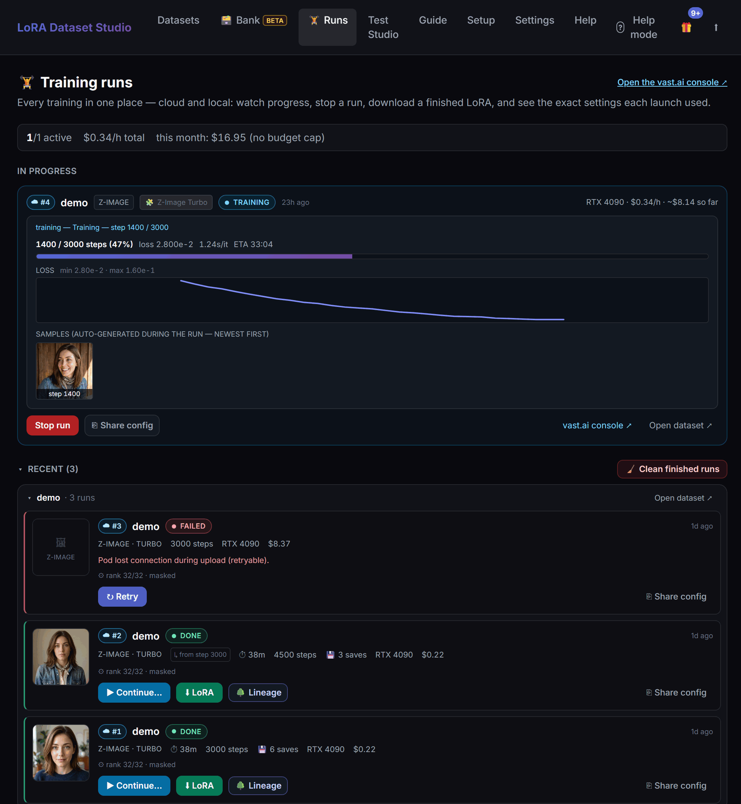
</p>
<p align="center"><em>Every run, local and cloud, in one place — live progress, the exact settings it used, and one-click Stop / Retry / Continue / Download / Share.</em></p>

---

## 7. Read the family tree

Every time you continue or fork a run, a **lineage** is born. The Runs page draws it as a **family tree** — ☰ List or ◉ Graph (now the default) — and turns it into a full experiment lab.

In the ◉ Graph the trunk lights the path root → current run, each continuation's edge starts on the checkpoint it resumed from, and set-aside branches stay dashed. Cloud ☁ and local 💻 runs sit side by side, each tagged on-disk or gone.

The graph does far more than draw:

- **List ↔ Graph** — a compact list or a left-to-right tree with flowing connectors; the path to the run you're viewing lights up, each run shows its saved **checkpoints as pills**, and a continuation's edge is anchored on the **exact epoch** it resumed from. A branch that resumed from an earlier save stays visible — dashed — instead of vanishing.
- **Click a run to inspect** the exact settings it trained with (rank, alpha, LR, optimizer, timestep, base, EMA…).
- **Take notes** on any run or checkpoint (● marks the annotated ones).
- **Shift-click two runs to diff** their configs side by side, only the differences highlighted.
- **Generate a same-prompt / same-seed preview per checkpoint** to compare how the LoRA evolves epoch by epoch, with a 🔍 **big-preview** mode that lays the results out like a ComfyUI grid — so you pick the sweet spot before it overcooks.
- **Deploy any checkpoint straight from its pill** (📦 Import → ComfyUI), **⬇ download** that exact epoch, or **▶ continue from here** — even from a run that failed at pod teardown but kept its saves.
- **Import & remove** — a single run opens a lineage the moment it has one saved checkpoint (also from a dataset's Checkpoints & LoRAs panel); older continuations reconnect automatically on first start; runs whose files are gone are tagged, not invented.

<p align="center">
  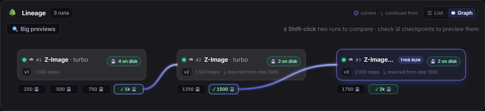
  &nbsp;
  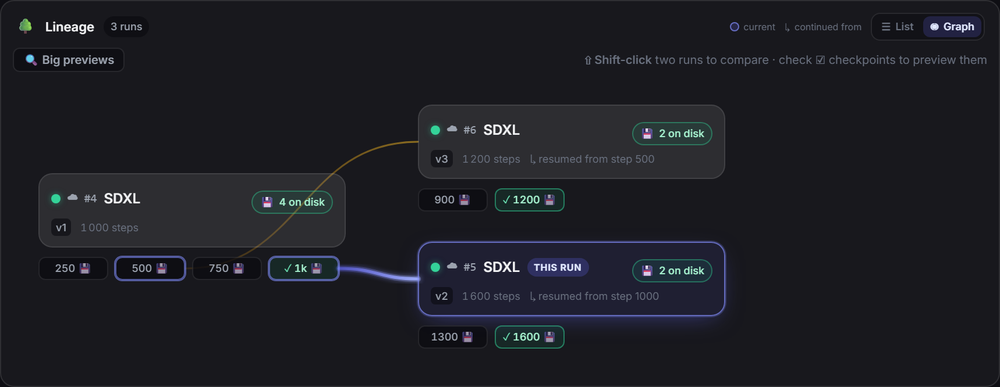
</p>
<p align="center"><em>Different shapes read at a glance: a linear v1 → v3 chain (left) and a fork where two runs branch from the same checkpoint, the set-aside branch kept dashed (right).</em></p>

<p align="center">
  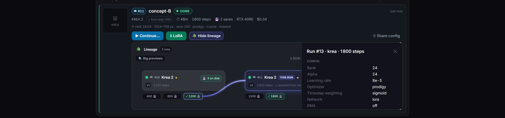
</p>
<p align="center"><em>Click any run to inspect the exact settings it trained with — and jot notes on runs or checkpoints (● marks the annotated ones).</em></p>

<p align="center">
  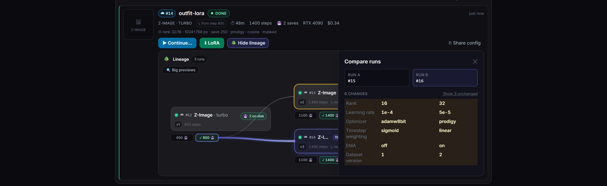
</p>
<p align="center"><em>Shift-click two runs to diff their configs side by side — only what changed is highlighted.</em></p>

<p align="center">
  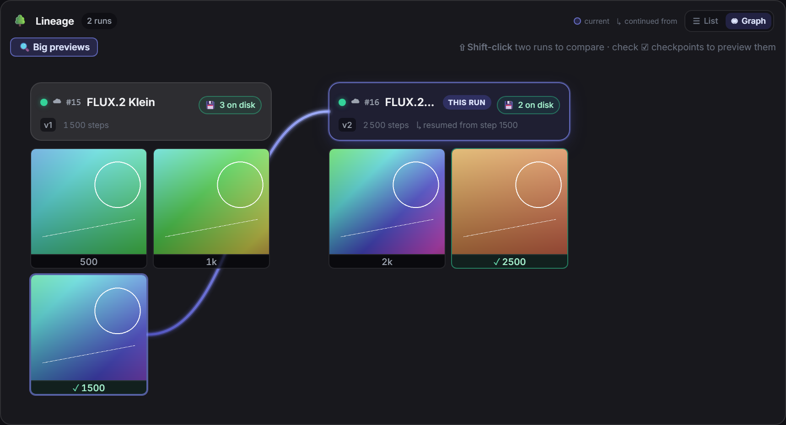
</p>
<p align="center"><em>Generate a same-prompt / same-seed preview per checkpoint and flip on 🔍 big previews to compare epochs like a ComfyUI grid — pick the sweet spot before it overcooks.</em></p>

<p align="center">
  
</p>
<p align="center"><em>Every saved checkpoint is actionable: download that exact epoch, deploy it to ComfyUI, or continue a fresh run from it.</em></p>

---

## 8. Pick the best checkpoint

A LoRA that's *trained* isn't necessarily a LoRA that's *good*. Test Studio uses ComfyUI to compare **checkpoint/LoRA × strength** with a fixed seed and one or more images per configuration.

- **The sweep** — strength runs **0 → 2.0** by default, with a discreet **+** chip that reveals the over-cook range up to **4.0** and a mirrored **−** chip for **negative strengths down to −2.0** — the way you exercise the negative pole of a slider LoRA (yours or any downloaded one). A single-LoRA run inspects its epochs in detail; selecting multiple LoRAs from the **same family** builds a LoRA × strength comparison grid.
- **🔎 Describe** — need a test prompt? Drop any image and the local Ollama vision model turns it into one — scene, pose, framing and outfit in compact prose, never the person's identity or the trigger word.
- **Vote & rank** — quick votes feed a **Wilson ranking**, and Character results can also be ranked by **face similarity**. A failed cell shows its reason and is excluded from ranking.
- **Export the grid** — when a run reads well, export it as a single labeled image (title banner with model/CFG/steps/seed, checkpoint rows, strength columns) ready to post on Civitai or Reddit; the composer works even with **ComfyUI offline**.
- **Flip in place** — opened results flip without leaving the grid: swipe on touch, **‹ ›** buttons or **arrow keys** on desktop, with an *i / n* counter and wrap-around, and strength variants of the same render sit adjacent so comparing strengths is one keypress.

Studio currently supports **Z-Image, SDXL and Krea 2**; FLUX.1 and FLUX.2 Klein can be trained and managed but don't yet have Studio workflows. Before launch the selected family is preflighted: a missing ComfyUI model or node gives you one actionable message instead of an empty grid.

---

## 9. Take it with you

Nothing here locks your data in — every stage has an exit.

- **Training ZIP** — export kept `image` + same-stem `.txt` caption pairs for ai-toolkit/Kohya-compatible training, or write the sidecars directly beside images in the dataset folder.
- **Merge existing data** — import a training ZIP or recursively merge a local folder containing images and same-stem `.txt` files; perceptual duplicates are skipped.
- **💾 Back up everything** — one portable backup packs every dataset (images, references, keep/reject decisions, captions, scores), its **training history** and your settings into a single file (API keys deliberately excluded). Restore rebuilds every dataset without overwriting, bringing back each one's **Trained** status and run history; tick **Include trained LoRAs** to bundle the `.safetensors` too.
- **Hugging Face Hub** — with a write-enabled `HF_TOKEN`, publish kept images and captions as a dataset repository. Publishing is **private by default**; you choose visibility/license and must explicitly confirm sharing rights and consent.
- **Import into ComfyUI** — local checkpoints import in one click; downloaded cloud results import automatically when a ComfyUI LoRA folder is configured.

---

## Why this instead of ai-toolkit?

"Instead of" is the wrong frame: this app is **not a competitor to [ai-toolkit](https://github.com/ostris/ai-toolkit) — it orchestrates it**. When you click Train, ai-toolkit is the engine running underneath. The real question is whether to drive it through this studio or by hand (its own UI and config files):

| Stage of the job | ai-toolkit alone | LoRA Dataset Studio |
|---|---|---|
| Build the dataset from one photo | ❌ none — you arrive with your images | ✅ 3-engine fan-out, 53-shot variation catalog, 12/6/6/1 composition target |
| Build the dataset from the web | ❌ none | ✅ Reddit search and supported gallery/search URLs into any dataset (dedup + quality filters) |
| Triage a giant unsorted dump | ❌ none | ✅ Image bank — quality scan, dup groups, by-person clustering, aesthetic/NSFW scores, then promote keepers |
| Curate | ❌ your file explorer | ✅ keep/reject, crop/mirror, auto-triage, multi-select, Klein candidates, composition meter and **InsightFace scoring** |
| Captions | ❌ write them yourself | ✅ JoyCaption/Ollama, prose vs booru by family, Concept leak checks and content-only Style rules |
| Masked training | ⚙️ consumes `mask_path` if you supply masks | ✅ generates rembg masks and writes the config for Character; safely disables them for Concept/Style |
| Training | ✅ **it is the engine** — direct config/YAML control | ⚙️ orchestrates adaptive/scoped recipes, preflight guards, advanced controls, queue/scheduling and continue +N |
| Pick the best checkpoint | ❌ its sample images + your eye | ✅ Z-Image/SDXL/Krea Studio grids, same-family multi-LoRA comparison, Wilson voting and optional face ranking |
| Move or publish the dataset | ⚙️ manual file handling | ✅ training ZIP, portable backup/restore, merge from ZIP/folder, optional Hugging Face publishing |

**Honest verdict:** the studio is strongest when you want one guided path from raw images to a reviewed Character, Concept or Style LoRA. It now exposes common expert controls such as rank, optimizer, scheduler and timestep weighting, but a raw ai-toolkit config still offers the widest surface for unsupported architectures or experimental keys. The two coexist cleanly: ai-toolkit remains the engine, and the studio's standard ZIP/sidecars let you move between them at any time.

## Feature matrix by backend

Not every feature needs every backend. The app degrades gracefully — API keys show a Configured/Not-set status in Settings, endpoint reachability can be tested via the "Test" button, and gated features simply don't appear until their dependency is satisfied.

| Feature | Requires |
|---|---|
| API image generation (Nano Banana Pro) | `GEMINI_API_KEY` |
| API image generation (ChatGPT / `gpt-image-2`) | `OPENAI_API_KEY` |
| Klein image generation / single or bulk 2 MP improvement | ComfyUI reachable + Klein model installed |
| Captioning | Ollama **or** ai-toolkit (JoyCaption) |
| Auto-classify framing / auto head-crop | Ollama (vision model) |
| Face-similarity scoring / score-based auto-triage | `backend/requirements-ml.txt` (insightface + onnxruntime) |
| Character person masks | `backend/requirements-ml.txt` (rembg); Concept/Style intentionally disable masks |
| Image bank scoring (aesthetic / NSFW / style / crops) | `backend/requirements-ml.txt` (Bank scoring extra) |
| Watermark detection (scraped datasets) | Ollama (vision model) |
| Watermark inpainting (LaMa) | `backend/requirements-ml.txt` (simple-lama-inpainting) — without it, Clean crops border marks only |
| Scrape images into a dataset (Reddit search + supported gallery/search URLs) | `backend/requirements-scrape.txt`; Pexels enumeration additionally requires `PEXELS_API_KEY` and uses the official API instead of gallery-dl |
| Concept-caption inversion / concept-leak checks | Ollama **or** ai-toolkit (JoyCaption) |
| LoRA training | ai-toolkit installed and configured |
| Cloud training (vast.ai) | `VAST_API_KEY`; Z-Image / Krea 2 / FLUX.2 Klein only |
| Test Studio (Z-Image / SDXL / Krea 2) | ComfyUI reachable + the selected family's model assets |
| Portable backup/restore and ZIP/folder dataset merge | No external service |
| Publish kept pairs to Hugging Face | Write-enabled `HF_TOKEN`; repositories are private by default |

## Run it your way

**API-only** — dataset creation, generation via Gemini/ChatGPT, import/scrape, manual curation/captions, backup and export. Runs on any machine with Python and no GPU; this is what the Docker image ships. No ComfyUI, ai-toolkit or local ML extras required.

**Full local** — everything above plus Klein/Z-Image generation, captioning via JoyCaption, face scoring, masks, the Image bank scoring pass, training, and Test Studio. Requires ComfyUI and/or ai-toolkit running on the same host (or reachable over the network) and an NVIDIA GPU with 12 GB+ VRAM for Klein/Z-Image inference. Training VRAM depends on the model family — check the family's ai-toolkit preset before queuing a run. The face-scoring and masking helpers (`requirements-ml.txt`) run fine on CPU; they don't need the GPU.

Either way, if you have no local GPU you can still train — see [No GPU? Train in the cloud](#no-gpu-train-in-the-cloud).

## Setup & install

On first launch the **Setup** wizard scans your machine, tells you what's already installed, and walks you through the rest — but you can skip it and start building a dataset from your own photos right now, no setup required.

The machine scan lists each capability as a **clickable row** that jumps straight to its install step, and the local ML extras install **per capability** rather than all-or-nothing: face scoring, person masks, Bank scoring and watermark inpainting each have their own one-click install, with an **↻ Reinstall** to repair or update just that one. When you're ready, **Install everything** queues every installable component with a live **X / N** progress bar, running heavy installs one at a time so they never clash.

<p align="center">
  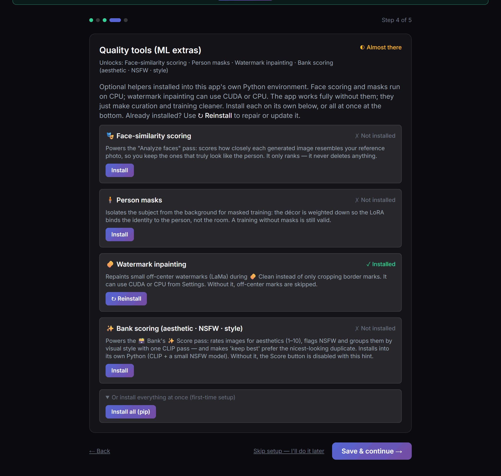
</p>
<p align="center"><em>Install everything queues every missing component with a live X / N bar; a per-item ↻ Reinstall repairs one without redoing the rest.</em></p>

The ComfyUI step can place Klein's model, consistency LoRA, text encoder and VAE in the folders the workflows expect. The Klein diffusion model is Black Forest Labs' public **9B KV** build (reference-image KV caching → faster multi-reference editing); the consistency LoRA is a community model by **[dx8152](https://huggingface.co/dx8152/Flux2-Klein-9B-Consistency)** (apache-2.0), recommended for reference edits — not an official Black Forest Labs release. Settings → Maintenance also checks for app updates, links to their details, and can update/restart a git checkout.

<p align="center">
  
</p>
<p align="center"><em>Setup detects ComfyUI (optional), an Ollama vision model, and ai-toolkit — and helps you install whatever's missing.</em></p>

### Option 1 — release ZIP + start.bat (Windows)

From the [latest GitHub release](https://github.com/perfectgf/lora-dataset-studio/releases/latest),
download **`LoRA-Dataset-Studio-windows.zip`** when that asset is present; otherwise
use GitHub's automatically provided **Source code (zip)**. Extract the whole archive,
then double-click:

```
start.bat
```

Releases deliberately contain an archive/source, not a prebuilt executable launcher.
No Python is needed up front: `start.bat` looks for a compatible interpreter
(`py -3.12/3.11/3.10` — the range with prebuilt wheels for the optional ML extras)
and, if it finds none, **downloads a self-contained CPython 3.12** into a local
`.python\` folder (~44 MB, once — no system install, no admin, nothing added to
PATH). It then creates a `.venv`, installs `backend/requirements.txt`, opens
`http://127.0.0.1:5050/` in your browser, and starts the server. (Already have
Python 3.10–3.12? It's used as-is and nothing is downloaded. On 3.13+ only, the
core app still runs but the ML extras can't install.) Override the port with
`set LDS_PORT=<port>` before running.

You can use the same flow from a git checkout instead of the release ZIP:

```bash
git clone https://github.com/perfectgf/lora-dataset-studio.git
cd lora-dataset-studio
start.bat
```

### Option 2 — manual venv (any OS)

Clone/download the source, open a terminal in its root, then run:

```bash
python -m venv .venv
source .venv/bin/activate        # Windows: .venv\Scripts\activate
pip install -r backend/requirements.txt
# optional, for face scoring + masks:
pip install -r backend/requirements-ml.txt
python backend/run.py
```

If you need to rebuild the frontend (e.g. you changed something under `frontend/src`):

```bash
cd frontend
npm install
npm run build
```

### Option 3 — Docker (API-only)

Copy `.env.example` to `.env` first — the compose file bind-mounts `./.env`, and Docker will otherwise create an empty directory in its place:

```bash
cp .env.example .env
```

Then build and run:

```bash
docker compose up --build
```

This builds and runs the API-only mode (see `Dockerfile` / `docker-compose.yml`) — ComfyUI and ai-toolkit are host-native tools and out of scope for the container. Data persists to `./data-docker` on the host, and your API keys are mounted in from `.env`.

### External tools (install once, connect in Settings)

None of these are bundled — each one is optional, installed separately, and then simply pointed to from the app's Settings page. Features light up automatically once their tool is detected (the "Test" button next to each field tells you immediately whether the app can see it).

| Tool | Unlocks | Get it |
|---|---|---|
| [ai-toolkit](https://github.com/ostris/ai-toolkit) (Ostris) | LoRA **training**, JoyCaption **captioning** | Follow its README install (clone + its installer creates a `venv`) |
| [ComfyUI](https://github.com/comfyanonymous/ComfyUI) | **Klein** local generation/improvement, **Test Studio**, checkpoint/LoRA discovery | Windows portable build, git install, or the ComfyUI Desktop app; keep it running on `http://127.0.0.1:8188` |
| [Ollama](https://ollama.com) | Auto-captioning, framing auto-classify, head-crop, watermark detection | Install, then `ollama pull huihui_ai/qwen3-vl-abliterated:8b-instruct` (the uncensored **abliterated** build; keep the **-instruct** tag, not the Thinking one — or set your own vision model in Settings) |

**ai-toolkit** — install it anywhere (e.g. `C:\ai-toolkit`), following [its own instructions](https://github.com/ostris/ai-toolkit#installation). Paste the folder path into **Settings → Local tools → ai-toolkit directory** and hit Test — training and JoyCaption captioning appear once it's valid. The app looks for `<folder>/run.py` and auto-detects the interpreter from a `venv/` **or** `.venv/` next to it (Scripts\python.exe on Windows, bin/python on Linux). Installed with conda, uv, or system Python and have **no venv folder**? Leave the directory pointing at the ai-toolkit folder and fill the optional **Python interpreter** field with the full path to the python that has ai-toolkit's dependencies. Job configs, datasets, and outputs live under that same folder by default (overridable under "Advanced").

**ComfyUI** — this app talks to a running ComfyUI over its HTTP API and scans its `models/` folders to list checkpoints and LoRAs. Set **Settings → ComfyUI API URL** (default `http://127.0.0.1:8188`) and **ComfyUI install directory** (the folder containing `models/`, `output/`, `input/`). Each family's base model goes in the layout its scanner expects:

- **Z-Image** → a sub-folder whose name contains **`z image`** (or `zimage`) under `models/unet` (or `models/diffusion_models`) — e.g. `models/unet/z image/bigLove_zt3.safetensors`. A file dropped **loose** in `models/unet` is *not* detected. The text encoder and VAE go at `models/text_encoders/Z image/qwen_3_4b.safetensors` and `models/vae/z ae.safetensors`.
- **SDXL** → `models/checkpoints` (a `Biglove/` sub-folder is also scanned).
- **Krea 2** → the default UNET at the root of `models/unet`; any extra Krea checkpoints under a `krea` sub-folder.

Trained LoRAs land in `models/loras/<family>` automatically after training. Generated images are pulled back over the ComfyUI API, so a custom ComfyUI output directory is fine — it doesn't need to match the install dir.

**Models outside `models/`?** If your ComfyUI uses an `extra_model_paths.yaml` (portable builds and Stability Matrix installs commonly do), the app parses it the same way ComfyUI does — arbitrary profiles, `base_path` with `~`/`$VAR` expansion, `is_default` ordering and legacy aliases — so bases that live elsewhere are seen exactly as ComfyUI sees them, across Klein generation, the Setup probes, the model picker and Studio preflight. Without a yaml, nothing changes.

**No custom nodes required.** The Klein generation and Test Studio workflows run on a **stock ComfyUI** using only its core and built-in `comfy_extras` nodes — nothing from ComfyUI-Manager to install. As a safety net, if a graph ever references a node your ComfyUI doesn't expose, the app answers one clear "install pack X, restart ComfyUI" message instead of a raw ComfyUI validation error.

**Ollama** — used as the lightweight local vision backend (auto-captioning, framing classify, head-crop, and watermark detection). Any vision-capable model works; the default the app looks for is `huihui_ai/qwen3-vl-abliterated:8b-instruct` — the **abliterated** (uncensored) build, so it captions adult datasets instead of refusing them. Stick to the **Instruct** variant — the *Thinking* variant reasons out loud instead of captioning, so avoid it. If you run a different one, set its exact tag in **Settings → Ollama vision model**. The app detects Ollama in **three states** — not installed, installed-but-stopped, or running — and when it's installed but the server isn't up, Settings/Setup show a **▶ Start Ollama** button that launches it for you (no terminal needed). If Ollama (or the model) is missing entirely, the app degrades gracefully: imports fall back to a centered crop and captioning falls back to JoyCaption or manual captions.

### Getting API keys

- **Gemini** (for Nano Banana Pro): go to [aistudio.google.com](https://aistudio.google.com), click **Get API key**, and paste it into the app's Settings page.
- **OpenAI** (for ChatGPT / `gpt-image-2`): go to [platform.openai.com](https://platform.openai.com) → **API keys**, create a key, and paste it into Settings.
- **Hugging Face** (gated model downloads and dataset publishing): create a token at [huggingface.co/settings/tokens](https://huggingface.co/settings/tokens). Read access is enough for accepted gated models; publishing requires a write-enabled token.
- **vast.ai** (optional cloud training): create/copy your key from [cloud.vast.ai](https://cloud.vast.ai/) and save it as `VAST_API_KEY` in Settings.

Secrets entered through Settings are stored in a git-ignored `.env` file (see `.env.example`) — they are never written to `config.json` or committed.

## Minimum requirements

The app scales from "no GPU at all" to a full local training rig — each capability has its own floor, and everything degrades gracefully (missing pieces are simply hidden or guided through Setup).

| Mode / capability | GPU (NVIDIA) | Disk | Notes |
|---|---|---|---|
| **API-only** (generate via Gemini/ChatGPT, import/scrape, curate, caption manually, export/backup) | none | ~2 GB | Any machine with Python 3.10–3.12; Docker image available |
| **Auto-captioning & framing** (Ollama vision, 8B model) | ~8 GB VRAM | ~7 GB | Runs alongside generation, not concurrently |
| **Local generation** (Klein 9B **KV** fp8 via ComfyUI) | ~16 GB VRAM | ~30 GB (model + text encoder + VAE) | Free, NSFW-capable; Setup downloads the models. The KV build is up to **2.5× faster on multi-reference edits** at the same quality, and downloads publicly (no HF token) |
| **LoRA training — Z-Image / SDXL** (ai-toolkit) | 16 GB+ recommended | 10 GB+ free enforced per run | Quantized (qfloat8) + low-VRAM mode |
| **LoRA training — Krea 2** (ai-toolkit) | **24 GB VRAM** at 1024px (enforced warning) | ~24 GB base download (Raw) + 10 GB+ free | 12B model. Under 24 GB, set **Resolution → 768 only** in ⚙️ Advanced options — the main VRAM lever |
| **LoRA training — FLUX.2 Klein** (ai-toolkit) | 4B: **16–24 GB VRAM** · 9B: **32–48 GB** (cloud lane) | base download + 10 GB+ free | Both bases gated on Hugging Face (HF token required). Train the 9B via ☁️ cloud |
| **Face scoring / person masks / watermark inpaint** (ML extras) | none (CPU) | ~3 GB (+ a CPU torch for LaMa inpaint) | Python **3.10–3.12 required** (no wheels beyond); installable per capability from Setup |

- **OS**: Windows 10/11 for the full local stack (`start.bat`). Linux/macOS work for API-only + manual venv.
- **Python**: 3.10–3.12 — but not required up front: `start.bat` fetches a self-contained CPython 3.12 if your machine has none. 3.13+ (already installed) runs the core app but can't install the ML extras.
- **RAM**: 16 GB+ recommended when training locally.
- Reference rig used for development: RTX 4090 (24 GB) — every number above was measured or enforced there.

## Configuration & settings reference

> **The living, complete reference is inside the app** — **Guide → Settings reference** documents every setting with its default and traps, and is mirrored on GitHub at **[docs/guide/settings-reference.md](docs/guide/settings-reference.md)**. That page now carries the full `config.json` key reference too.

The short version:

- **Ordinary settings** are written to `config.json` (git-ignored, in your data directory). Copy `config.example.json` to `config.json` to edit by hand — but almost everything has a UI control in **Settings**.
- **Secrets** (`GEMINI_API_KEY`, `OPENAI_API_KEY`, `HF_TOKEN`, `VAST_API_KEY`, optional scraper keys) live in `.env`, never in `config.json` or a commit — copy `.env.example` to `.env`, or paste keys into Settings and let the app write them.
- **A handful of environment variables** override paths for containerized setups: `LDS_DATA_DIR` (runtime data), `LDS_CONFIG` (path to `config.json`), `LDS_ENV` (path to `.env`), `LDS_HOST` (bind host, beats `server.host`), `FLASK_DEBUG` (`1` for Flask debug).
- **The keys you most often touch** — `server.port` (default `5050`), `comfyui.api_url`, `ollama.vision_model`, `aitoolkit.dir`, `training.default_family`, the `cloud.*` guard-rails — are all in the [full reference](docs/guide/settings-reference.md#configjson-key-reference-all-keys).

## Exposing the app beyond localhost

The simplest path is the UI. **Settings → Server & access** has an *Available on the local network* toggle (flips the bind between `127.0.0.1` and `0.0.0.0`), an optional *Require an access token* switch (off by default — a home LAN is trusted), and an **Open it on your phone** card that shows a scannable **QR code** plus copyable URLs built from this machine's real LAN IP (and Tailscale IP, if present) — no guessing which address to type. Changing the port or the LAN toggle needs a restart; the card does it in one click.

Under the hood: the app has **no user accounts**, so on `127.0.0.1` (the default) that's fine, but any other bind would hand the whole network your API keys, GPU and datasets. On a non-loopback bind you can require an **access token**: with the token gate on, `run.py` generates one at boot (printed to the console with a ready-to-open URL) unless you set `LDS_ACCESS_TOKEN` yourself. Open `http://<machine>:<port>/?token=<token>` once from the remote device — a signed session cookie takes over from there. Requests from localhost never need the token. If your network is already locked down (VPN, authenticated reverse proxy), `LDS_ALLOW_UNAUTHENTICATED=1` disables the guard explicitly.

## Known limitations

- Krea 2's img2img workflow (`backend/workflows/krea2_turbo_img2img.json`) ships in the repo but isn't wired into a Test Studio mode yet — only the text-to-image Krea 2 workflow is currently reachable from the UI.
- ComfyUI-dependent code paths (Klein generation, Test Studio, the consistency-LoRA path normalization for Windows ComfyUI) are covered by unit tests against a mocked ComfyUI API; they haven't all been exercised against a live ComfyUI instance yet. If something looks wrong when wiring up your own ComfyUI, check Settings → the "Test" button next to each endpoint.
- The dataset workspace remembers your last-used generator (`localStorage`) and defaults to Nano Banana Pro on a first visit. If you've only configured an OpenAI key, the Nano Banana card shows disabled and the Generate button stays greyed out until you explicitly click the ChatGPT card — a one-click step that's easy to miss right after onboarding.

## Troubleshooting

**`npm install` fails with `Cannot find module @rollup/rollup-<platform>-...`**
A known npm bug ([npm/cli#4828](https://github.com/npm/cli/issues/4828)) can make `package-lock.json` "remember" the platform it was generated on. Fix: run `npm i -D @rollup/rollup-<your-platform>` for your OS/arch, or delete `frontend/node_modules` and `frontend/package-lock.json` and run `npm install` again on the target platform.

**Training log looks frozen for several minutes**
This is normal — ai-toolkit's stdout is block-buffered during model load and latent caching, so nothing prints for a while even though it's working. Check GPU utilization or watch for new files under the ai-toolkit output directory to confirm it's alive; a "warming up" state before the first logged step is expected.

**ComfyUI shows as unreachable**
Check `comfyui.api_url` in Settings, confirm ComfyUI is actually running, and check that nothing (firewall, a different bind interface) is blocking the connection between this app and ComfyUI.

**Ollama isn't detected (or shows as installed but stopped)**
The app reports Ollama in three states. *Installed but stopped* — the binary is on disk but the server isn't answering — shows a **▶ Start Ollama** button in Settings/Setup; click it to launch the server (it stays running independently of this app, so it survives a restart). *Not installed* means no binary was found on your PATH or in Ollama's default install location — install it from [ollama.com](https://ollama.com/download), then reopen Settings. Once it's running, pull the vision model (`ollama pull huihui_ai/qwen3-vl-abliterated:8b-instruct`, the uncensored **Instruct** build) so captioning, framing and watermark detection light up.

**Port 5000 conflicts with AirPlay Receiver on macOS**
macOS reserves port 5000 for AirPlay Receiver by default. Change `server.port` in `config.json` to something else (e.g. `5050`) and restart.

**Windows console shows garbled characters (mojibake) from `start.bat`**
Cosmetic only — some UTF-8 text (em dashes, accents) renders incorrectly on the legacy Windows console codepage. It doesn't affect functionality.

Still stuck? Open the app's **Guide → Getting help** for the one-click **diagnostic report** (version, capability status, log tail — no keys, no paths), then post it on [Discord](https://discord.gg/j6hnJBFtXE) or in a [GitHub issue](https://github.com/perfectgf/lora-dataset-studio/issues).

## Support the project

If LoRA Dataset Studio saves you time, you can support development on
[**GitHub Sponsors**](https://github.com/sponsors/perfectgf) — one-time or monthly, and 100% goes to the project (GitHub charges no platform fees).
Bug reports, ideas in [Discord](https://discord.gg/j6hnJBFtXE) and repo stars help just as much.

## Legal & responsible use

> **Short version:** this software is a neutral tool. What you feed it and what you do with the result is entirely your responsibility. Some of its features can build a LoRA of a *real, identifiable person* — doing that without that person's consent may be illegal where you live, and is explicitly outside the intended use of this project.

*This section is not legal advice. Laws differ by country, state, and platform, and they change. If you are unsure whether a particular use is lawful, consult a qualified lawyer before proceeding — not this README.*

### What this project is for

LoRA Dataset Studio is intended for building datasets from imagery **you have the right to use**, specifically:

- **Yourself**, or
- **Synthetic / AI-generated people** who do not exist (the demo person shown throughout this README is one such synthetic identity), or
- **Real adults who have given you explicit, informed consent** to train and generate their likeness.

Any other use — in particular training a look-alike model of a real person from photos scraped, downloaded, or otherwise obtained without their consent — is **not** a use this project endorses or supports.

### Your responsibilities as the operator

Because the app runs entirely on your machine, under your control, **you** are the data controller and the sole party responsible for every dataset you build and every image you generate. That includes ensuring you have the necessary rights and that your use complies with all applicable law, which may include (non-exhaustively):

- **Likeness, publicity & personality rights** — many jurisdictions give people control over the commercial and non-commercial use of their face, name, and likeness.
- **Biometric-data law** — a face-recognition/similarity model of an identifiable person can constitute biometric personal data under regimes such as the EU/UK **GDPR**, Illinois **BIPA**, and similar state and national statutes, with consent and disclosure obligations attached.
- **Non-consensual intimate imagery & deepfake statutes** — a growing number of countries and U.S. states criminalize creating or sharing sexual or intimate deepfakes of real people without consent. Do not use this tool to make them.
- **Child protection law** — generating sexual or exploitative imagery of minors, real or synthetic, is a serious crime effectively everywhere. This is an absolute prohibition, without exception.
- **Copyright & platform terms** — source images may themselves be copyrighted, and scraping may violate a site's terms of service. The built-in scraper is a convenience for collecting material you are entitled to use; respect each site's terms, `robots` directives, rate limits, and the copyright of the images you download.

### Prohibited uses

Do not use this software to:

- Create a model or imagery of **any real person without their consent**;
- Produce **sexual, intimate, defamatory, harassing, or misleading** content depicting a real person without consent;
- Produce **any** sexual or exploitative content involving **minors**, real or synthetic;
- Impersonate a real person or organization, commit fraud, or otherwise deceive;
- Violate the terms of service, copyright, or rate limits of any site the scraper touches.

### No warranty & limitation of liability

This software is provided **"as is", without warranty of any kind**, express or implied, including but not limited to the warranties of merchantability, fitness for a particular purpose, and non-infringement (see the [PolyForm Noncommercial License 1.0.0](LICENSE) for the full terms). As far as the law allows, **the licensor accepts no liability** for damages — including any legal consequence arising from datasets, models, or images you create with it. By using this software you accept that responsibility yourself.

## Contributing

Issues, ideas and pull requests are welcome. For anything bigger than a small fix, say hello first — on [Discord](https://discord.gg/j6hnJBFtXE) (**#help** for questions, **#roadmap** for ideas) or in a [GitHub issue](https://github.com/perfectgf/lora-dataset-studio/issues). See [CONTRIBUTING.md](CONTRIBUTING.md) for dev setup, tests, and PR conventions, and the [Code of Conduct](CODE_OF_CONDUCT.md) for how we treat each other. Found a security issue? Report it privately — see [SECURITY.md](SECURITY.md).

## License

Licensed under the **PolyForm Noncommercial License 1.0.0** — see [LICENSE](LICENSE). Noncommercial use is permitted; commercial use requires separate permission from the licensor.
