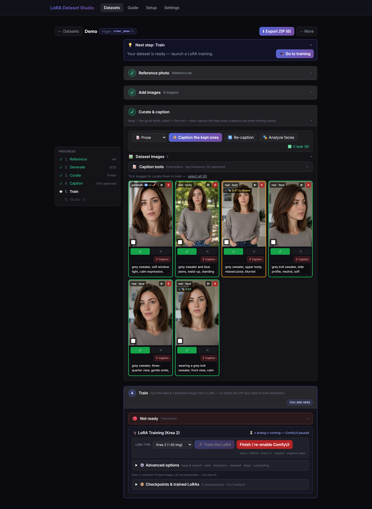
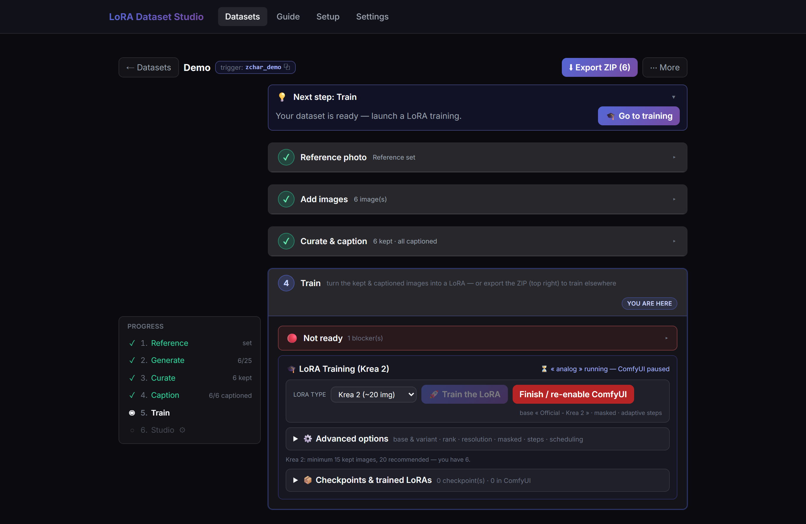
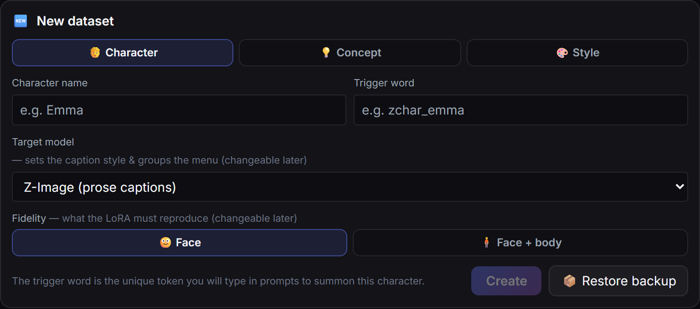
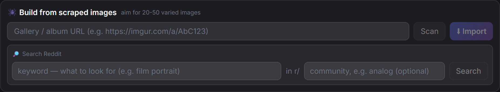
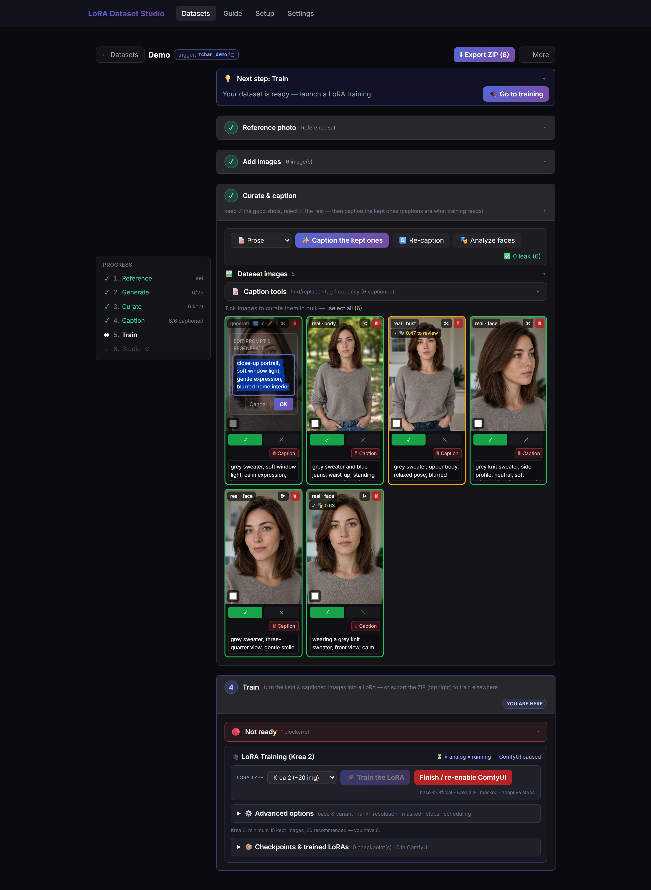
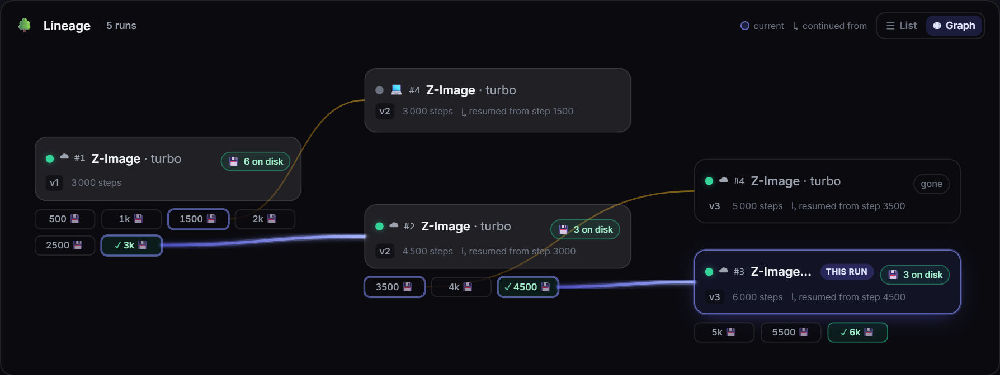
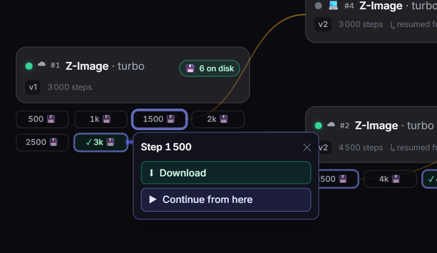
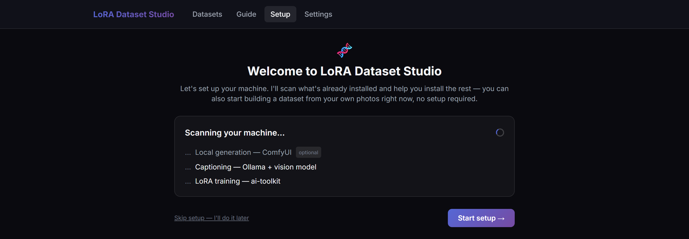

# LoRA Dataset Studio

[](https://github.com/perfectgf/lora-dataset-studio/actions/workflows/ci.yml) [](https://discord.gg/j6hnJBFtXE) [](https://github.com/sponsors/perfectgf)

**Build, train and rank Character, Concept and Style LoRAs — curation, captioning, quality checks and training behind a single browser tab, on your own machine.**

🖥️ **Train locally** on your own NVIDIA GPU — or ☁️ **train in the cloud** on a rented pod (~$1–2 per run, no GPU required): same one-click flow, every epoch synced back to your machine. You can even bring your own custom base weights to either lane.

📑 **Not sure which settings to use?** Fifteen researched presets ship built-in — a Character, Style and Concept recipe for each family, sourced from Ostris' ai-toolkit defaults, vendor guidance and documented community consensus. One click applies the whole recipe.

The useful part of LoRA training isn't only the training — it's building a clean, varied, well-captioned image set. That job is normally scattered across a scraper, an image editor, a captioning script, and training configs. LoRA Dataset Studio puts the pipeline behind one UI: fan out a character from reference photos, import or scrape material for a concept or a style, triage a giant unsorted folder down to its keepers, curate and caption, run quality checks, train locally or in the cloud, then rank the resulting checkpoints in a test studio — without leaving the page.

<p align="center">
  
</p>
<p align="center"><em>The curation grid — every image tagged by framing (face / bust / body), scored against the reference face, captioned, and one click from keep or reject.<br>All screenshots in this README use a synthetic, AI-generated demo person — no real individual is depicted.</em></p>

---

## Everything it does, at a glance

The whole pipeline, grouped by stage — every item links to the section that details it.

| Stage | What you get |
| :-- | :-- |
| 🏗️ **Build** | 🎭 **[3 dataset types](#1-three-dataset-types-character--concept--style)** — character, concept or style; each rewires captioning, masking and step-scaling to match.<br>🖼️ **[3 image sources](#2-three-ways-to-source-images)** — generate from references, import your own, or scrape supported web sources.<br>🗃️ **[Image bank (Beta)](docs/guide/using-the-app.md#the-image-bank-triage-a-big-folder)** — triage a giant unsorted dump in place: quality scan, duplicate groups with keep-best, sort **by person** or by style, aesthetic/NSFW scores, watermark flags, captions with full-text search — or run the whole chain overnight with **🚀 Launch all**, then promote the keepers into a dataset.<br>🧭 **[Guided workspace](#3-the-guided-workspace)** — a progress rail maps each stage and shows what's blocking Train.<br>✏️ **[Edit & regenerate](#8-edit-the-prompt-regenerate-the-shot)** — tweak any generated tile's prompt in place and re-shoot it. |
| 🎯 **Curate & caption** | 📐 **[Auto-framing + meter](#5-auto-framing-classification)** — auto-tags character shots face/bust/body/back and scores the set against a 12/6/6/1 target.<br>👤 **[Face scoring + auto-triage](#4-face-similarity-scoring)** — InsightFace flags off-identity shots and can sort undecided scored images while preserving later manual status changes.<br>☑️ **[Bulk curation](#3-the-guided-workspace)** — Keep, Reject, Undecide, clear captions, delete, or create Klein candidates for a selection.<br>📝 **[Model-matched captions](#6-captioning-that-matches-the-model)** — prose or booru tags, picked for the model and written by JoyCaption or Ollama.<br>🧽 **[Watermark cleanup](#7-auto-clean-scraped-watermarks)** — finds overlaid logos/URLs, then crops or inpaints them with two engines (fast LaMa or Klein quality) and a review step. |
| 🎓 **Train** | 🎛️ **[Guided training with advanced controls](#9-guided-training-advanced-when-you-need-it)** — adaptive defaults plus rank/alpha, resolution, LoRA/LoKr, optimizer, scheduler, timestep, EMA and save/sample controls.<br>🧬 **[5 model families](#9-guided-training-advanced-when-you-need-it)** — Z-Image, SDXL, Krea 2, FLUX.1 and FLUX.2 Klein, with distinct variants and safety checks.<br>📑 **[Training presets](#9-guided-training-advanced-when-you-need-it)** — fifteen researched read-only recipes ship, one Character, Style and Concept preset per family, every value sourced; custom presets import/export as JSON.<br>🎚 **[Slider LoRAs (Beta)](#9-guided-training-advanced-when-you-need-it)** — learn one bipolar LoRA from a prompt pair; all five families, local or cloud, expect to iterate.<br>☁️ **[Cloud training](#cloud-training-vastai--experimental)** — rent a vast.ai pod with price/runtime caps, retry and continue, on an official *or* your own custom base.<br>🏋️ **[Runs hub](#9-guided-training-advanced-when-you-need-it)** — local and cloud progress, Stop, retry/continue, downloads and paste-safe config sharing. |
| 🚀 **Test & ship** | 🧪 **[Test Studio](#10-test-studio--pick-the-best-checkpoint)** — compare checkpoint/LoRA × strength (−2.0 → 4.0) within one supported family, vote, rank, and export the grid as a shareable image.<br>📦 **[Export, backup and publish](#11-export-backup-and-publish)** — training ZIPs, full portable backups, merges from existing datasets and private-by-default Hugging Face publishing. |
| 🌐 **Comfort & access** | 📱 **[Phone access](#exposing-the-app-beyond-localhost)** — scan a QR to open the app on your phone over LAN or Tailscale.<br>🧰 **[Setup wizard](#setup--install)** — scans your machine and installs only what's missing.<br>📖 **[Guide + diagnostics](#troubleshooting)** — a 5-chapter in-app manual and a one-click, paste-safe diagnostic report. |

---

## Recent improvements

- **🗃️ Image bank (Beta) — a giant unsorted folder becomes a dataset** — point the new **Bank** tab at a huge, messy dump (a Telegram export, a scrape pile): a quality scan flags blurry/noisy/flat/too-small shots, near-duplicates group up with one **keep-best** click, and a face pass sorts everything **by person — no reference photo needed**. Then **✨ Score** rates aesthetics, flags NSFW and groups by visual style, **🚩 Find watermarks** flags overlaid logos/URLs, a per-subfolder scope slices a big export by chat, and a **📂 Browse** button opens your own folder dialog. Your source folder is never modified; promote the keepers straight into a dataset.
- **⚙️ Per-dataset caption options** — a new **⚙️ Options** button in Captions lets you pick the engine (Auto / JoyCaption / Ollama vision), choose or **pull** the exact Ollama vision model, set a **Vocabulary** preset for how nudity is named (Explicit / Clinical / Safe), and add your own wording instructions — all remembered on the dataset and layered on top of the built-in guardrails.
- **⬆️ "Update & restart" now works for ZIP installs** — installed from a release ZIP with no Git? The update button used to just send you off to download by hand; now it names the release and its size, **downloads and installs** it with a live progress bar, keeps your datasets, settings, `.env` and Python environment intact, and **rolls back automatically** if anything fails. Git checkouts update exactly as before.
- **🧰 A one-click install step in Setup** — after you configure your services, **Install everything** queues every installable component (ML extras, the Ollama vision model, Klein weights) with a live **X / N** progress bar; heavy installs run one at a time so they never clash. A per-item menu stays available with a **↻ Reinstall** on each, to repair a single broken component without redoing the rest.
- **💾 Back up everything — Trained state included** — a **💾 Back up everything** button packs every dataset (images, captions, statuses, references), its training history and your settings into one file (API keys deliberately excluded). Restore rebuilds every dataset without overwriting, and now brings back each one's **Trained** status and run history instead of "Not trained yet". Tick **Include trained LoRAs** to bundle the `.safetensors` themselves.
- **🧬 Dual long + short captions** — a new Advanced option turns on ai-toolkit's native long+short captioning: every image trains with a full caption **and** a brief one, so the LoRA leans less on any single wording. The short variant is written for you from the long one (same rules, no trigger) and is editable per image. Local training only for now.
- **⚡ Klein 9B KV by default** — new installs download the **public** KV build: up to **2.5× faster** multi-reference editing at identical quality, and **no Hugging Face token needed** for generation. Existing installs keep their current file; nothing re-downloads.

Older improvements roll into [CHANGELOG.md](CHANGELOG.md).

---

## Roadmap

Directions, not dates. These are discussed openly on the project's Discord, and the most-requested ideas move up the list.

- **🧬 Merge Lab** *(next big one)* — bake your trained LoRAs into a standalone, shareable checkpoint and merge models with guided recipes, judged side by side in the Test Studio (same seeds, A/B grids). Full model fine-tuning on large curated datasets comes later on the same path.
- **🎨 Anima (anime) family** — now unblocked upstream: ai-toolkit merged Anima support ([ostris/ai-toolkit#860](https://github.com/ostris/ai-toolkit/pull/860)), opening the door to a first-class anime training family.
- **🎬 WAN 2.1 / 2.2 video LoRAs** — ai-toolkit already trains WAN and the scraper can already pull video, so the whole pipeline (scrape, curate, caption, train, test) extends naturally to motion. Community-driven.
- **🧠 Smarter watermark detection** — a dedicated NSFW-trained detector and optional cleaning during import (subject-safe masked inpainting already shipped with the Klein engine).
- **🧩 More base models** — additional Flux-family bases (Chroma, Qwen-Image…) with the same one-click flow as Krea 2.

---

## Table of contents

- [Everything it does, at a glance](#everything-it-does-at-a-glance)
- [Roadmap](#roadmap)
- [How it works, in one pass](#how-it-works-in-one-pass)
- [Features, one at a time](#features-one-at-a-time)
  - [1. Three dataset types](#1-three-dataset-types-character--concept--style)
  - [2. Three ways to source images](#2-three-ways-to-source-images)
  - [3. The guided workspace](#3-the-guided-workspace)
  - [4. Face-similarity scoring](#4-face-similarity-scoring)
  - [5. Auto-framing classification](#5-auto-framing-classification)
  - [6. Captioning that matches the model](#6-captioning-that-matches-the-model)
  - [7. Auto-clean scraped watermarks](#7-auto-clean-scraped-watermarks)
  - [8. Edit the prompt, regenerate the shot](#8-edit-the-prompt-regenerate-the-shot)
  - [9. Guided training, advanced when you need it](#9-guided-training-advanced-when-you-need-it)
  - [10. Test Studio — pick the best checkpoint](#10-test-studio--pick-the-best-checkpoint)
  - [11. Export, backup and publish](#11-export-backup-and-publish)
- [Why this instead of driving ai-toolkit directly?](#why-this-instead-of-driving-ai-toolkit-directly)
- [Feature matrix by backend](#feature-matrix-by-backend)
- [Two run modes](#two-run-modes)
- [Cloud training (vast.ai)](#cloud-training-vastai--experimental)
- [Setup & install](#setup--install)
- [Minimum requirements](#minimum-requirements)
- [Configuration reference](#configuration-reference)
- [Exposing the app beyond localhost](#exposing-the-app-beyond-localhost)
- [Known limitations](#known-limitations)
- [Troubleshooting](#troubleshooting)
- [Legal & responsible use](#legal--responsible-use)
- [Contributing](#contributing)
- [License](#license)

---

## How it works, in one pass

The app is a **guided flow**: each stage stays folded until the one before it is done, and a progress rail tells you exactly where you are and what's blocking the next step. The character path looks like this (a **concept** or **style** dataset skips the reference photo and sources images by import/scrape instead):

<p align="center">
  
</p>
<p align="center"><em>The workspace walks you from reference photo → generate → curate → caption → train, one unlocked step at a time.</em></p>

1. **Create a dataset** — pick Character, Concept or Style and its target model. Character/Concept use an activation trigger; Style is always-on and keeps only an internal run identifier.
2. **Upload a reference photo** (+ up to 3 extra angles for multi-view consistency).
3. **Generate variations** via Nano Banana Pro (Gemini), ChatGPT (`gpt-image-2`), or Klein (local ComfyUI).
4. **Import** full-frame or with optional head-crop for Character datasets.
5. **Auto-classify framing** (face / bust / body / back) via a local vision model.
6. **Curate** — keep/reject, crop, mirror, auto-triage by face score, or act on a multi-selection; Character sets get a live **12 face · 6 bust · 6 body · 1 back** meter.
7. **Caption** — prose for Z-Image/Krea/FLUX or booru tags for SDXL. Style captions describe image content only and never contain an activation trigger.
8. **Score face similarity** against the reference (InsightFace, green/orange thresholds).
9. **Generate person masks** (rembg) for masked training.
10. **Train a LoRA** via ai-toolkit — preflight checks, adaptive steps, researched built-in presets per family and kind, advanced controls, a queue and scheduling.
11. **Test Studio** — compare checkpoints or multiple LoRAs from one supported family across strengths, then vote and rank the results.
12. **Take the dataset with you** — export a training ZIP, create a portable backup, merge an existing dataset, or publish kept pairs to Hugging Face.

> 📖 **New here?** The **Guide** tab inside the app is a 5-chapter manual: getting started, day-to-day usage, dataset quality (also readable as [docs/DATASET_GUIDE.md](docs/DATASET_GUIDE.md)), troubleshooting, and how to report problems — with a one-click diagnostic report. The chapters live in [docs/guide/](docs/guide/) if you prefer reading on GitHub.

---

## Features, one at a time

### 1. Three dataset types (Character · Concept · Style)

Character and Concept LoRAs use an activation trigger: captions keep variable details promptable while the omitted invariant binds to that token. Style is intentionally different — it is always-on, so content-only captions separate *what is pictured* from the unspoken aesthetic instead of binding that aesthetic to a trigger.

<p align="center">
  
</p>
<p align="center"><em>Pick the type and the app reconfigures captioning, masking, and step-scaling behind the scenes.</em></p>

- **Character** — pin an identity from one reference photo. The app fans out a **45-shot variation catalog** (expression / angle / lighting / framing / outfit / background) so the set spans close-up to full-body without you writing a single prompt.
- **Concept** — train an *object or action* instead of a person. Captioning **inverts**: it describes everything *except* the concept and checks that the concept name did not leak back into the text, so the invariant binds to the trigger. Person masking turns itself off so it cannot erase what you are teaching.
- **Style** — train an *always-on global aesthetic*. Every kept image needs its own content-only caption describing subject, action and setting while leaving the aesthetic, medium and artist unspoken. No activation trigger is written to sidecars, previews, configs or shared run summaries. Style uses **50 steps/image**, rounded up to the next 100 and clamped to a safe family/variant envelope; effective caption dropout is **0% for cached Krea recipes and 5% elsewhere**. Missing, trigger-only or identical captions are caught before launch. Combine a Style LoRA with a Character LoRA by tuning the two LoRA weights independently.

### 2. Three ways to source images

- **Generate** — from one or more reference photos, through Nano Banana Pro, ChatGPT (`gpt-image-2`), or a local Klein/ComfyUI model. Each request includes identity-preservation instructions and the selected references; generated results still need human review.
- **Import** — drag in your own photos. Concept/Style keep the full frame; Character can optionally auto-crop around the head (or use a centered/manual crop when local vision is unavailable).
- **Scrape** — collect real images from supported web sources into any dataset. This is its own panel, covered next.

#### Using a ChatGPT subscription instead of an API key (experimental)

If you have a ChatGPT Plus/Pro subscription you can run the ChatGPT engine on your plan's image quota instead of a pay-per-use API key: **Settings → ChatGPT subscription → Connect with ChatGPT** (or **Import from Codex CLI** if you already use `codex login`).

Good to know:

- **Experimental.** This uses the same subscription lane as OpenAI's Codex sign-in. It is not a documented API and may stop working at any time; you connect your own account at your own risk. The API-key mode is unaffected.
- **Limits vs API mode:** up to 5 reference images per generation (instead of 16), and your plan's image cap applies. When the quota runs out mid-batch, the remaining rows fail with a clear message — the app never silently switches to your paid API key.
- Auth mode is configurable (**Settings → ChatGPT engine auth**): Auto (subscription when connected, otherwise API key), API key only, or Subscription only.

#### Built-in web scraper

The scraper is available in every dataset (and is especially useful for Concept/Style sets). Its **Reddit | Pexels | URL** switch keeps each workflow clear: search Reddit by keyword with an optional community, search Pexels by keyword without constructing a URL, or paste a supported gallery / album / direct-media URL for sources such as Instagram, X/Twitter, Civitai and direct Pexels photos or collections. Switching source does not discard the current result grid, and pagination remains attached to the last search actually launched. Selected frames download **directly into the open dataset**, never a shared pool.

<p align="center">
  
</p>
<p align="center"><em>Choose Reddit, Pexels or URL, launch a search, then pick frames straight into the dataset.</em></p>

What it does on your behalf:

- **SSRF-hardened** — the fetcher refuses internal/loopback/link-local targets, so a hostile URL can't turn the scraper into a request proxy into your network.
- **Perceptual de-duplication** — near-identical frames are dropped so the same shot doesn't get counted five times.
- **Quality filters at import** — images wider than a 3:1 ratio are rejected. Images under 768 px on the short side are rejected by default, or can be sent to the optional Klein rescue flow instead.
- **Dead-link hygiene** — source links whose thumbnails fail to load are hidden from the grid, so you only ever pick live images.
- **Sensible guidance baked in** — the panel nudges you toward 20–50 varied images, at most ~10 per gallery (one gallery ≈ one shoot), which is what actually trains well.

Source credentials live in **Settings → Scraping & sources**. Your own free **Reddit client ID** is optional (the built-in shared one is rate-limited — a personal id gives you a private quota and clears the "retry in Ns" 429s), as is a **Civitai API key** (Civitai scans return SFW results only without one). Pexels is the exception: its API key is required for every Pexels scan.

Pexels listings are queried through its **official API**, not `gallery-dl`. [Create a free API key](https://www.pexels.com/api/key/) and save it under **Settings → Scraping & sources**; it takes effect immediately. The free quota is **200 requests/hour and 20,000/month**. In the Pexels mode, enter a keyword, choose French (`fr-FR`, the default) or English (`en-US`), and optionally restrict orientation to portrait, landscape or square. The URL mode remains available for direct Pexels photos and collections. The scraper extras remain required because LDS uses `curl_cffi` to proxy thumbnails and import the selected files. Collection access depends on the API key, so a collection that is not available to your key may return 404; Pexels profile URLs (`/@user`) are not supported by the official API. Keep the photographer, photo-source, and Pexels attribution links that LDS displays with API results.

> **Pexels authorization required:** An API key alone does not authorize dataset or machine-learning use. Configure and use this integration only if Pexels has explicitly authorized this use case. The Pexels panel links the [official Pexels terms and conditions](https://help.pexels.com/hc/en-us/articles/900005880463-What-are-the-Terms-and-Conditions) and requires a locally persisted confirmation before any Pexels keyword search or direct Pexels URL scan can run.

The scraper can reach adult communities as well — this is an NSFW-capable tool — so use it only for material you have the right to train on. See [Legal & responsible use](#legal--responsible-use). The scraping extras (`gallery-dl`, `curl_cffi`, …) install with one click from the panel when they're missing.

### 3. The guided workspace

Whatever you're building — character, concept, style or a slider — the progress rail on the left keeps the whole pipeline legible: what's done, what's next, what's blocking Train. Long server-side batches — captioning, face analysis, framing classify, watermark scan/clean — show a live progress indicator that **survives a page reload**: refresh mid-run and the button picks the batch back up instead of looking idle. For character sets specifically, a composition meter also rides along: as you keep and reject, it tracks your framing mix against the **12 / 6 / 6 / 1** target and tells you what the set is still missing (*"needs more full-body shots"*) — the difference between a dataset that renders faces well and one that also knows the body.

The grid is built for real curation work: resize thumbnails, zoom, crop or mirror individual images, then multi-select to **Keep, Reject, Undecide, clear captions, delete, or Improve via Klein**. Klein improvements run sequentially as separate 2 MP candidates and leave every source untouched. On mouse/trackpad the per-image controls stay out of the way until hover/focus; on touch devices they remain visible.

### 4. Face-similarity scoring

Before an off-identity shot can poison training, **InsightFace** scores every image against your reference and badges it — green for a strong match, orange for borderline — with thresholds you set in Settings. In the curation grid above, the badges (e.g. `0.63` green, `0.47 to review`) are exactly this: a numeric, sortable signal for *"is this even the right person?"* that your eye alone will miss on shot 40.

**Auto-triage** can apply a chosen score threshold to currently undecided, scorable images. It skips images with no face score. During the same session you can move the threshold and re-apply it to new undecided images plus rows whose status still matches auto-triage's last decision; a later manual status change removes that row from the replay set.

### 5. Auto-framing classification

A local vision model classifies each image as **face / bust / body / back** and stamps a badge on the tile. That's what feeds the composition meter — and it's why the app can tell you the set is close-up-heavy without you tagging anything by hand.

### 6. Captioning that matches the model

Captions are what training actually reads, and the right *form* depends on the base model:

- **Prose** sentences for Z-Image / Krea 2 / FLUX.1 / FLUX.2 Klein, **booru-style tags** for SDXL — selected automatically from the dataset's target model.
- Generated by **JoyCaption** (via ai-toolkit) or an **Ollama** vision model.
- **Concept datasets invert** the caption: it names everything *but* the concept and flags captions that accidentally name the concept itself.
- **Style datasets** require a distinct content-only caption for every kept image and strip the internal dataset identifier from exported sidecars and sample prompts.
- A **find/replace + frequency** panel, tag hide/isolate controls, expanded editor and bulk caption clearing let you sweep the whole set at once.

### 7. Auto-clean scraped watermarks

Real images pulled off the web carry **overlaid watermarks** — a site logo, a URL, an `@username`, studio text stamped on top of the photo. Left in, the LoRA learns them. This tool appears for datasets containing scraped images and removes marks in a **Find → Review → Clean** flow:

- **🧽 Find watermarks** runs a local vision pass (Qwen3-VL) over the kept images and flags each overlaid mark with a 🚩 badge and a stored bounding box. It *deletes nothing* — it targets logos/URLs/usernames added on top of the photo, not scene text like signs or clothing prints.
- **🧽 Clean (N)** routes each flagged image by cost and risk, with an **engine picker** — **LaMa (fast)** or **Klein (quality)**:
  - a mark sitting in an outer **border band** is **cropped off** (pure pixel crop — it invents nothing, and never cuts a side below 768 px);
  - a small **off-centre** mark is **inpainted** — with LaMa (local, limited to the masked region, CPU or CUDA), or with the **Klein engine**: LaMa pre-fills the mark, then a FLUX.2 Klein refine pass regenerates real texture over the soft patch, and the result is composited back **in pixel space** so every pixel outside the mark keeps its original bytes;
  - with the LaMa engine, anything large or sitting on the subject is left for **manual review** rather than risking a bad auto-edit — with the **Klein engine those on-subject marks become cleanable too**.
  Every edited image keeps its watermarked original as a sibling `.orig` backup, and Clean reports one honest summary (cropped / inpainted / need review / failed).
- **🔍 Review flagged (N)** opens a lightbox that steps through the flagged images one at a time: you see the **detected box drawn** on the shot and the tool's planned action, pick the engine, then Clean it (and see the **cleaned result** before moving on), **dismiss** it as a false positive (the 🚩 clears and future Find passes never re-flag it), or reject it outright.

Inpainting is an ML extra: without it installed, Clean still crops border marks and simply *skips* the off-centre ones — a one-click **⬇ Install inpainting** button sits right next to the tools to add it. The Klein engine additionally needs ComfyUI with the FLUX.2 Klein models (the same preflight/auto-download as Klein generation), and since LaMa is its pre-fill stage, no inpainting extras means Klein cleaning reports itself unavailable instead of degrading silently.

### 8. Edit the prompt, regenerate the shot

Every generated tile carries a ✏️ button next to crop and delete. Click it and the exact prompt that produced the image opens in an inline bubble — tweak the wording (*"soft window light,"* *"three-quarter view"*), hit **OK**, and the tile regenerates through the same engine with your edit, re-wrapped in the identity guard so the face is preserved. The edited prompt is saved with the image, so the next regenerate starts from where you left off.

<p align="center">
  
</p>
<p align="center"><em>Fix a shot's framing or lighting by editing its prompt in place — no re-typing, no losing the rest of the set.</em></p>

### 9. Guided training, advanced when you need it

Click **Train** and ai-toolkit runs underneath. The recommended path needs no config file, while **⚙ Advanced** exposes the levers needed for deliberate experiments:

- **Adaptive step policies** — Character uses roughly 120 steps/image (1500–3500), Concept uses `475 × √images` (2000–12000), and Style uses 50 steps/image inside a family/variant-specific safe envelope.
- **Readiness and launch guards** — minimum image counts, untriaged rows, missing/suspicious captions, near-duplicates, Character composition, VRAM, disk space, base architecture and family/variant compatibility are checked again at launch, queue start, continue and cloud retry.
- A **training queue** with scheduling, so runs line up instead of colliding on the GPU, plus a protected **Stop run** action for the identified local process.
- **Character-only masked training** from auto-generated rembg masks. Concept and Style force person masking off so the subject or full-frame aesthetic is not erased.
- **Continue +N steps** to extend a run. Local checkpoints have a one-click import into ComfyUI; downloaded cloud results are imported automatically when a ComfyUI LoRA folder is configured.
- **Fifteen scoped built-ins** — a **Built-in (researched)** group ships a Character, Style and Concept recipe for each of the five families (Z-Image, SDXL, Krea 2, FLUX.1-dev, FLUX.2 Klein). Every value is sourced (ai-toolkit defaults, vendor guidance or documented community consensus) with a one-line *why*, and the picker only shows a recipe when dataset kind, family and variant match. Save/import/export your own Advanced recipe as JSON too.
- **Advanced controls** — rank/alpha, resolution, LoRA or LoKr, network dropout, timestep weighting, optimizer, learning-rate scheduler/warmup, gradient accumulation, EMA, save/sample cadence and preview prompts.
- **Checkpoint housekeeping** — a **Saves kept** cap lets ai-toolkit trim older intermediate checkpoints during the run (default 4, so a long Krea run no longer piles up ~10 GB of snapshots), and everything the app deletes goes to an app-wide **Trash** (Settings → Maintenance) that you empty on your own terms.
- **One place for every run** — **🏋️ Runs** collects cloud and local training: live step/loss/ETA/samples, the exact recipe and dataset version, **Stop**, cloud **Retry/Continue**, downloads, and **⎘ Share config** — a paste-safe parameter/outcome summary with local paths and keys stripped.
- **Lineage at a glance** — every continuation and fork is drawn as a **family tree** (☰ List or ◉ Graph). Each run shows the checkpoints it saved as pills, an edge is anchored on the exact epoch a continuation resumed from, the path to the current run lights up, and a branch that resumed from an earlier save stays visible — dashed — instead of vanishing. Click any checkpoint to download it or **continue from there**.

<p align="center">
  
</p>
<p align="center"><em>◉ Graph — a run's whole lineage as a family tree. The trunk lights the path root → current run, each continuation's edge starts on the checkpoint it resumed from, and set-aside branches stay dashed. Cloud ☁ and local 💻 runs sit side by side, each tagged on-disk or gone.</em></p>

<p align="center">
  
</p>
<p align="center"><em>Every saved checkpoint is actionable: download that exact epoch, or continue a fresh run from it.</em></p>

- **Five training families with distinct recipes** — **Z-Image** (Turbo/Base/De-Turbo), **SDXL**, **Krea 2** (Raw/Turbo), **FLUX.1**, and **FLUX.2 Klein** (4B/9B). Custom compatible weights train locally for any family, and Z-Image, Krea 2 and FLUX.2 Klein can also train on a custom base **in the cloud** via a one-time push to a private Hugging Face repo (SDXL and FLUX.1 stay local-only).
- **🎚 Slider LoRA mode (Beta)** — turn any dataset into a **concept slider**: give a positive and a negative prompt and ai-toolkit's `concept_slider` trainer learns a single bipolar LoRA whose ±strength dials the trait at inference (the images are only a denoising substrate, so caption guards the slider never reads are skipped). A fixed 1000-step policy, low default rank, bipolar preview samples and an isolated `_slider` run tag keep it from clobbering a normal setup. All five families are offered behind honest experimental notes — **Krea 2 is the reference** — and it runs **locally or in the cloud**: slider settings are snapshotted at launch so a mid-run edit can never retarget a rented run (the first paid slider run is still unproven — extra-Beta). Beta, so expect to iterate. Test both poles with Test Studio's **negative strengths**.

### 10. Test Studio — pick the best checkpoint

A LoRA that's trained isn't necessarily a LoRA that's *good*. Test Studio uses ComfyUI to compare **checkpoint/LoRA × strength** with a fixed seed and one or more images per configuration. A single-LoRA run can inspect its epochs in detail; selecting multiple LoRAs from the **same family** builds a LoRA × strength comparison grid. Quick votes feed a Wilson ranking, and Character results can also be ranked by face similarity.

The strength sweep runs **0 → 2.0** by default, with a discreet **+** chip that reveals the over-cook range up to **4.0** and a mirrored **−** chip for **negative strengths down to −2.0** — the way you exercise the negative pole of a slider LoRA (yours or any downloaded one). Need a test prompt? **🔎 Describe** turns any dropped image into one via the local Ollama vision model — scene, pose, framing and outfit in compact prose, never the person's identity or the trigger word. When a run reads well, **export the grid** as a single labeled image (title banner with model/CFG/steps/seed, checkpoint rows, strength columns) ready to post on Civitai or Reddit; the composer works even with ComfyUI offline. Opened results **flip in place** — swipe on touch, **‹ ›** buttons or **arrow keys** on desktop, with an *i / n* counter and wrap-around — and strength variants of the same render sit adjacent, so comparing strengths is one keypress.

Studio currently supports **Z-Image, SDXL and Krea 2**; FLUX.1 and FLUX.2 Klein can be trained and managed but do not yet have Studio workflows. Before launch, the selected family is preflighted: if ComfyUI is missing a required model file or node, you get one actionable message instead of an empty grid. A failed cell shows its reason and is excluded from ranking.

### 11. Export, backup and publish

Nothing here locks your data in:

- **Training ZIP** — export kept `image` + same-stem `.txt` caption pairs for ai-toolkit/Kohya-compatible training, or write the sidecars directly beside images in the dataset folder.
- **Merge existing data** — import a training ZIP or recursively merge a local folder containing images and same-stem `.txt` files; perceptual duplicates are skipped.
- **Portable backup** — save all images, references, keep/reject decisions, captions, scores and settings, then restore it as a new dataset on another installation.
- **Hugging Face Hub** — with a write-enabled `HF_TOKEN`, publish kept images and captions as a dataset repository. Publishing is private by default; you choose visibility/license and must explicitly confirm sharing rights and consent.

---

## Why this instead of driving ai-toolkit directly?

"Instead of" is the wrong frame: this app is **not a competitor to [ai-toolkit](https://github.com/ostris/ai-toolkit) — it orchestrates it**. When you click Train, ai-toolkit is the engine running underneath. The real question is whether to drive it through this studio or by hand (its own UI and config files):

| Stage of the job | ai-toolkit alone | LoRA Dataset Studio |
|---|---|---|
| Build the dataset from one photo | ❌ none — you arrive with your images | ✅ 3-engine fan-out, 45-shot variation catalog, 12/6/6/1 composition target |
| Build the dataset from the web | ❌ none | ✅ Reddit search and supported gallery/search URLs into any dataset (dedup + quality filters) |
| Curate | ❌ your file explorer | ✅ keep/reject, crop/mirror, auto-triage, multi-select, Klein candidates, composition meter and **InsightFace scoring** |
| Captions | ❌ write them yourself | ✅ JoyCaption/Ollama, prose vs booru by family, Concept leak checks and content-only Style rules |
| Masked training | ⚙️ consumes `mask_path` if you supply masks | ✅ generates rembg masks and writes the config for Character; safely disables them for Concept/Style |
| Training | ✅ **it is the engine** — direct config/YAML control | ⚙️ orchestrates adaptive/scoped recipes, preflight guards, advanced controls, queue/scheduling and continue +N |
| Pick the best checkpoint | ❌ its sample images + your eye | ✅ Z-Image/SDXL/Krea Studio grids, same-family multi-LoRA comparison, Wilson voting and optional face ranking |
| Move or publish the dataset | ⚙️ manual file handling | ✅ training ZIP, portable backup/restore, merge from ZIP/folder, optional Hugging Face publishing |

**Honest verdict:** the studio is strongest when you want one guided path from raw images to a reviewed Character, Concept or Style LoRA. It now exposes common expert controls such as rank, optimizer, scheduler and timestep weighting, but a raw ai-toolkit config still offers the widest surface for unsupported architectures or experimental keys. The two coexist cleanly: ai-toolkit remains the engine, and the studio's standard ZIP/sidecars let you move between them at any time.

---

## Feature matrix by backend

Not every feature needs every backend. The app degrades gracefully — API keys show a Configured/Not-set status in Settings, endpoint reachability can be tested via the "Test" button, and gated features simply don't appear until their dependency is satisfied.

| Feature | Requires |
|---|---|
| API image generation (Nano Banana Pro) | `GEMINI_API_KEY` |
| API image generation (ChatGPT / `gpt-image-2`) | `OPENAI_API_KEY` |
| Klein image generation / single or bulk 2 MP improvement | ComfyUI reachable + Klein model installed |
| Captioning | Ollama **or** ai-toolkit (JoyCaption) |
| Auto-classify framing / auto head-crop | Ollama (vision model) |
| Face-similarity scoring / score-based auto-triage | `backend/requirements-ml.txt` (insightface + onnxruntime) |
| Character person masks | `backend/requirements-ml.txt` (rembg); Concept/Style intentionally disable masks |
| Watermark detection (scraped datasets) | Ollama (vision model) |
| Watermark inpainting (LaMa) | `backend/requirements-ml.txt` (simple-lama-inpainting) — without it, Clean crops border marks only |
| Scrape images into a dataset (Reddit search + supported gallery/search URLs) | `backend/requirements-scrape.txt`; Pexels enumeration additionally requires `PEXELS_API_KEY` and uses the official API instead of gallery-dl |
| Concept-caption inversion / concept-leak checks | Ollama **or** ai-toolkit (JoyCaption) |
| LoRA training | ai-toolkit installed and configured |
| Test Studio (Z-Image / SDXL / Krea 2) | ComfyUI reachable + the selected family's model assets |
| Portable backup/restore and ZIP/folder dataset merge | No external service |
| Publish kept pairs to Hugging Face | Write-enabled `HF_TOKEN`; repositories are private by default |

## Two run modes

**API-only** — dataset creation, generation via Gemini/ChatGPT, import/scrape, manual curation/captions, backup and export. Runs on any machine with Python and no GPU; this is what the Docker image ships. No ComfyUI, ai-toolkit or local ML extras required.

**Full local** — everything above plus Klein/Z-Image generation, captioning via JoyCaption, face scoring, masks, training, and Test Studio. Requires ComfyUI and/or ai-toolkit running on the same host (or reachable over the network) and an NVIDIA GPU with 12 GB+ VRAM for Klein/Z-Image inference. Training VRAM depends on the model family (Z-Image, SDXL, Krea 2, FLUX.1 and FLUX.2 Klein have different footprints) — check the family's ai-toolkit preset before queuing a run. The face-scoring and masking helpers (`requirements-ml.txt`) run fine on CPU; they don't need the GPU.

## Cloud training (vast.ai) — experimental

No local GPU? Add a **vast.ai API key** (Settings → Secrets, or the setup
wizard) and use **☁️ Train in cloud** in the Training panel. The app rents a
verified-datacenter GPU, uploads your dataset, trains with the exact same
ai-toolkit configuration as a local run, downloads the resulting
`.safetensors`, and terminates the pod automatically.

- Cost: you pay vast.ai directly and offer prices vary over time. A price cap
  (`cloud.max_price_per_hour`) and a hard runtime cap
  (`cloud.max_runtime_minutes`, default 4 h) are enforced before launch.
- Supported families: **Z-Image, Krea 2 and FLUX.2 Klein** — an official Hugging
  Face base, or **your own custom base** pushed one-time to a private repo on your
  HF account (private enforced, cached by combo hash so the same base never
  uploads twice; the pod pulls it with your token). The launch verifies the repo,
  files and sizes before renting anything. Klein 9B — 32-48 GB VRAM — is the
  cloud-first lane of its family. SDXL and FLUX.1 require local training.
- Manage it from the **🏋️ Runs** tab (top nav): retry a failed cloud run (↻),
  continue it for more steps (▶), stop a cloud or identified local run, and download
  the LoRA — both lanes appear side by side with the exact settings they used.
- Safety: pods are labeled `lds-<run-id>`; on every app start, orphaned pods
  are destroyed automatically. If the app is closed mid-run, the pod keeps
  training and the app resumes monitoring on restart.
- Privacy note: the pod belongs to your vast.ai account; dataset images and
  checkpoints transit through it and are destroyed with the pod.

---

## Setup & install

On first launch the **Setup** wizard scans your machine, tells you what's already installed, and walks you through the rest — but you can skip it and start building a dataset from your own photos right now, no setup required.

The machine scan lists each capability as a **clickable row** that jumps straight to its install step, and the local ML extras install **per capability** rather than all-or-nothing: face scoring, person masks and watermark inpainting each have their own one-click install, with an **↻ Reinstall** to repair or update just that one. The ComfyUI step can place Klein's model, consistency LoRA, text encoder and VAE in the folders the workflows expect. The Klein diffusion model is Black Forest Labs' public **9B KV** build (reference-image KV caching → faster multi-reference editing); the consistency LoRA is a community model by **[dx8152](https://huggingface.co/dx8152/Flux2-Klein-9B-Consistency)** (apache-2.0), recommended for reference edits — not an official Black Forest Labs release. Settings → Maintenance also checks for app updates, links to their details, and can update/restart a git checkout.

<p align="center">
  
</p>
<p align="center"><em>Setup detects ComfyUI (optional), an Ollama vision model, and ai-toolkit — and helps you install whatever's missing.</em></p>

### Option 1 — release ZIP + start.bat (Windows)

From the [latest GitHub release](https://github.com/perfectgf/lora-dataset-studio/releases/latest),
download **`LoRA-Dataset-Studio-windows.zip`** when that asset is present; otherwise
use GitHub's automatically provided **Source code (zip)**. Extract the whole archive,
then double-click:

```
start.bat
```

Releases deliberately contain an archive/source, not a prebuilt executable launcher.
No Python is needed up front: `start.bat` looks for a compatible interpreter
(`py -3.12/3.11/3.10` — the range with prebuilt wheels for the optional ML extras)
and, if it finds none, **downloads a self-contained CPython 3.12** into a local
`.python\` folder (~44 MB, once — no system install, no admin, nothing added to
PATH). It then creates a `.venv`, installs `backend/requirements.txt`, opens
`http://127.0.0.1:5050/` in your browser, and starts the server. (Already have
Python 3.10–3.12? It's used as-is and nothing is downloaded. On 3.13+ only, the
core app still runs but the ML extras can't install.) Override the port with
`set LDS_PORT=<port>` before running.

You can use the same flow from a git checkout instead of the release ZIP:

```bash
git clone https://github.com/perfectgf/lora-dataset-studio.git
cd lora-dataset-studio
start.bat
```

### Option 2 — manual venv (any OS)

Clone/download the source, open a terminal in its root, then run:

```bash
python -m venv .venv
source .venv/bin/activate        # Windows: .venv\Scripts\activate
pip install -r backend/requirements.txt
# optional, for face scoring + masks:
pip install -r backend/requirements-ml.txt
python backend/run.py
```

If you need to rebuild the frontend (e.g. you changed something under `frontend/src`):

```bash
cd frontend
npm install
npm run build
```

### Option 3 — Docker (API-only)

Copy `.env.example` to `.env` first — the compose file bind-mounts `./.env`, and Docker will otherwise create an empty directory in its place:

```bash
cp .env.example .env
```

Then build and run:

```bash
docker compose up --build
```

This builds and runs the API-only mode (see `Dockerfile` / `docker-compose.yml`) — ComfyUI and ai-toolkit are host-native tools and out of scope for the container. Data persists to `./data-docker` on the host, and your API keys are mounted in from `.env`.

### External tools (install once, connect in Settings)

None of these are bundled — each one is optional, installed separately, and then simply pointed to from the app's Settings page. Features light up automatically once their tool is detected (the "Test" button next to each field tells you immediately whether the app can see it).

| Tool | Unlocks | Get it |
|---|---|---|
| [ai-toolkit](https://github.com/ostris/ai-toolkit) (Ostris) | LoRA **training**, JoyCaption **captioning** | Follow its README install (clone + its installer creates a `venv`) |
| [ComfyUI](https://github.com/comfyanonymous/ComfyUI) | **Klein** local generation/improvement, **Test Studio**, checkpoint/LoRA discovery | Windows portable build, git install, or the ComfyUI Desktop app; keep it running on `http://127.0.0.1:8188` |
| [Ollama](https://ollama.com) | Auto-captioning, framing auto-classify, head-crop | Install, then `ollama pull huihui_ai/qwen3-vl-abliterated:8b-instruct` (the uncensored **abliterated** build; keep the **-instruct** tag, not the Thinking one — or set your own vision model in Settings) |

**ai-toolkit** — install it anywhere (e.g. `C:\ai-toolkit`), following [its own instructions](https://github.com/ostris/ai-toolkit#installation). Paste the folder path into **Settings → Local tools → ai-toolkit directory** and hit Test — training and JoyCaption captioning appear once it's valid. The app looks for `<folder>/run.py` and auto-detects the interpreter from a `venv/` **or** `.venv/` next to it (Scripts\python.exe on Windows, bin/python on Linux). Installed with conda, uv, or system Python and have **no venv folder**? Leave the directory pointing at the ai-toolkit folder and fill the optional **Python interpreter** field with the full path to the python that has ai-toolkit's dependencies. Job configs, datasets, and outputs live under that same folder by default (overridable under "Advanced").

**ComfyUI** — this app talks to a running ComfyUI over its HTTP API and scans its `models/` folders to list checkpoints and LoRAs. Set **Settings → ComfyUI API URL** (default `http://127.0.0.1:8188`) and **ComfyUI install directory** (the folder containing `models/`, `output/`, `input/`). Each family's base model goes in the layout its scanner expects:

- **Z-Image** → a sub-folder whose name contains **`z image`** (or `zimage`) under `models/unet` (or `models/diffusion_models`) — e.g. `models/unet/z image/bigLove_zt3.safetensors`. A file dropped **loose** in `models/unet` is *not* detected. The text encoder and VAE go at `models/text_encoders/Z image/qwen_3_4b.safetensors` and `models/vae/z ae.safetensors`.
- **SDXL** → `models/checkpoints` (a `Biglove/` sub-folder is also scanned).
- **Krea 2** → the default UNET at the root of `models/unet`; any extra Krea checkpoints under a `krea` sub-folder.

Trained LoRAs land in `models/loras/<family>` automatically after training. Generated images are pulled back over the ComfyUI API, so a custom ComfyUI output directory is fine — it doesn't need to match the install dir.

**Models outside `models/`?** If your ComfyUI uses an `extra_model_paths.yaml` (portable builds and Stability Matrix installs commonly do), the app parses it the same way ComfyUI does — arbitrary profiles, `base_path` with `~`/`$VAR` expansion, `is_default` ordering and legacy aliases — so bases that live elsewhere are seen exactly as ComfyUI sees them, across Klein generation, the Setup probes, the model picker and Studio preflight. Without a yaml, nothing changes.

**No custom nodes required.** The Klein generation and Test Studio workflows run on a **stock ComfyUI** using only its core and built-in `comfy_extras` nodes — nothing from ComfyUI-Manager to install. As a safety net, if a graph ever references a node your ComfyUI doesn't expose, the app answers one clear "install pack X, restart ComfyUI" message instead of a raw ComfyUI validation error.

**Ollama** — used as the lightweight local vision backend (auto-captioning, framing classify, head-crop, and watermark detection). Any vision-capable model works; the default the app looks for is `huihui_ai/qwen3-vl-abliterated:8b-instruct` — the **abliterated** (uncensored) build, so it captions adult datasets instead of refusing them. Stick to the **Instruct** variant — the *Thinking* variant reasons out loud instead of captioning, so avoid it. If you run a different one, set its exact tag in **Settings → Ollama vision model**. The app detects Ollama in **three states** — not installed, installed-but-stopped, or running — and when it's installed but the server isn't up, Settings/Setup show a **▶ Start Ollama** button that launches it for you (no terminal needed). If Ollama (or the model) is missing entirely, the app degrades gracefully: imports fall back to a centered crop and captioning falls back to JoyCaption or manual captions.

### Getting API keys

- **Gemini** (for Nano Banana Pro): go to [aistudio.google.com](https://aistudio.google.com), click **Get API key**, and paste it into the app's Settings page.
- **OpenAI** (for ChatGPT / `gpt-image-2`): go to [platform.openai.com](https://platform.openai.com) → **API keys**, create a key, and paste it into Settings.
- **Hugging Face** (gated model downloads and dataset publishing): create a token at [huggingface.co/settings/tokens](https://huggingface.co/settings/tokens). Read access is enough for accepted gated models; publishing requires a write-enabled token.
- **vast.ai** (optional cloud training): create/copy your key from [cloud.vast.ai](https://cloud.vast.ai/) and save it as `VAST_API_KEY` in Settings.

Secrets entered through Settings are stored in a git-ignored `.env` file (see `.env.example`) — they are never written to `config.json` or committed.

---

## Minimum requirements

The app scales from "no GPU at all" to a full local training rig — each capability has its own floor, and everything degrades gracefully (missing pieces are simply hidden or guided through Setup).

| Mode / capability | GPU (NVIDIA) | Disk | Notes |
|---|---|---|---|
| **API-only** (generate via Gemini/ChatGPT, import/scrape, curate, caption manually, export/backup) | none | ~2 GB | Any machine with Python 3.10–3.12; Docker image available |
| **Auto-captioning & framing** (Ollama vision, 8B model) | ~8 GB VRAM | ~7 GB | Runs alongside generation, not concurrently |
| **Local generation** (Klein 9B **KV** fp8 via ComfyUI) | ~16 GB VRAM | ~30 GB (model + text encoder + VAE) | Free, NSFW-capable; Setup downloads the models. The KV build is up to **2.5× faster on multi-reference edits** at the same quality, and downloads publicly (no HF token) |
| **LoRA training — Z-Image / SDXL** (ai-toolkit) | 16 GB+ recommended | 10 GB+ free enforced per run | Quantized (qfloat8) + low-VRAM mode |
| **LoRA training — Krea 2** (ai-toolkit) | **24 GB VRAM** at 1024px (enforced warning) | ~24 GB base download (Raw) + 10 GB+ free | 12B model. Under 24 GB, set **Resolution → 768 only** in ⚙️ Advanced options — the main VRAM lever |
| **LoRA training — FLUX.2 Klein** (ai-toolkit) | 4B: **16–24 GB VRAM** · 9B: **32–48 GB** (cloud lane) | base download + 10 GB+ free | Both bases gated on Hugging Face (HF token required). Train the 9B via ☁️ cloud |
| **Face scoring / person masks / watermark inpaint** (ML extras) | none (CPU) | ~3 GB (+ a CPU torch for LaMa inpaint) | Python **3.10–3.12 required** (no wheels beyond); installable per capability from Setup |

- **OS**: Windows 10/11 for the full local stack (`start.bat`). Linux/macOS work for API-only + manual venv.
- **Python**: 3.10–3.12 — but not required up front: `start.bat` fetches a self-contained CPython 3.12 if your machine has none. 3.13+ (already installed) runs the core app but can't install the ML extras.
- **RAM**: 16 GB+ recommended when training locally.
- Reference rig used for development: RTX 4090 (24 GB) — every number above was measured or enforced there.

## Configuration reference

> **The living, complete reference is inside the app:** **Guide → Settings reference** documents every setting with its default and traps (also readable on GitHub at [docs/guide/settings-reference.md](docs/guide/settings-reference.md)). The table below is the condensed cheat-sheet.

Copy `config.example.json` to `config.json` (git-ignored) and adjust. Main keys:

| Key | Meaning |
|---|---|
| `server.host` | Interface the Flask server binds to (default `127.0.0.1`, local-only). |
| `server.port` | Port the server listens on (default `5050`). |
| `server.require_token` | On a non-loopback bind, require remote clients to present an access token (default `false` — a trusted LAN needs none). Toggle and token also live in Settings → Server & access. |
| `paths.dataset_images_root` | Where dataset images are stored. Empty string defaults to `<data dir>/datasets`. |
| `comfyui.api_url` | Base URL of your ComfyUI instance (default `http://127.0.0.1:8188`). |
| `comfyui.base_dir` | ComfyUI install directory, used to derive `output`/`input`/`models`/`loras` dirs if those aren't set explicitly. |
| `comfyui.output_dir` | Explicit override for ComfyUI's output folder. |
| `comfyui.input_dir` | Explicit override for ComfyUI's input folder. |
| `comfyui.models_dir` | Explicit override for ComfyUI's models folder (used to scan available checkpoints/UNETs). |
| `comfyui.loras_dir` | Explicit override for ComfyUI's LoRA folder. |
| `ollama.url` | Base URL of your Ollama instance (default `http://127.0.0.1:11434`). |
| `ollama.vision_model` | Ollama vision model used for auto-classify and auto head-crop (default `huihui_ai/qwen3-vl-abliterated:8b-instruct`, the uncensored **abliterated** build — use the Instruct, not Thinking, variant). |
| `aitoolkit.dir` | ai-toolkit install directory. |
| `aitoolkit.datasets_dir` | Override for ai-toolkit's datasets folder (defaults to `<aitoolkit.dir>/datasets`). |
| `aitoolkit.output_dir` | Override for ai-toolkit's output folder (defaults to `<aitoolkit.dir>/output`). |
| `aitoolkit.hf_home` | Override for the Hugging Face cache directory ai-toolkit uses. |
| `aitoolkit.python` | Full path to the Python interpreter to run ai-toolkit with. Empty = auto-detect a `venv/`/`.venv/` next to `run.py`; set it for conda/uv/system-Python installs that have no venv folder. |
| `engines.default` | Default image-generation engine selected in the UI (`nanobanana`, `chatgpt`, or `klein`). |
| `engines.enabled` | List of engines shown as options in the UI. |
| `engines.chatgpt_auth` | Which credential the ChatGPT engine uses: `auto` (subscription when connected, else API key), `api`, or `subscription`. |
| `engines.chatgpt_subscription_model` | Codex **router** model for the subscription lane (default `gpt-5.4-mini`); the image model stays `gpt-image-2` regardless. |
| `captioning.backend` | Caption backend: `auto` (prefer JoyCaption, fall back to Ollama), `joycaption`, `ollama`, or `none`. |
| `training.default_family` | Default model family preselected for new training runs (`zimage`, `sdxl`, `krea`, `flux`, or `flux2klein`). |
| `cloud.max_concurrent_runs` | Simultaneous cloud pods allowed (default `1`, 1–10). Also in Settings → Training. |
| `cloud.max_price_per_hour` | Safety cap on the hourly offer price in $ (default `0.80`); pricier hosts are skipped before launch. |
| `cloud.monthly_budget_usd` | Hard monthly spend ceiling in $ (default `0` = unlimited); launches are blocked past it. |
| `cloud.stall_timeout_minutes` | Kill + rescue a cloud run after this many minutes without step progress (default `30`, 5–240). |
| `cloud.min_reliability` | vast.ai host-reliability floor (default `0.98`, 0.9–0.999); lower surfaces cheaper, riskier hosts. |
| `cloud.verified_only` | Restrict to vast.ai verified hosts (default `true`). |
| `cloud.secure_cloud_only` | Restrict to vast.ai's Secure Cloud (datacenter) tier (default `false`; narrows the market, raises price). |
| `face_scoring.python` | Python interpreter used to run the InsightFace subprocess (empty = current interpreter). |
| `face_scoring.models_root` | Directory where InsightFace model weights are stored/downloaded. |
| `face_scoring.green` | Similarity score threshold (0–1) above which an image is flagged "green" (strong match). |
| `face_scoring.orange` | Similarity score threshold (0–1) above which an image is flagged "orange" (borderline match). |
| `masks.python` | Python interpreter used to run the rembg subprocess (empty = current interpreter). |
| `watermark.python` | Python interpreter used to run the LaMa watermark-inpainting subprocess (empty = reuse `masks.python`, then the current interpreter). |
| `watermark.device` | LaMa processing device: `auto` (CUDA when available, otherwise CPU), `cuda`, or `cpu`. |
| `watermark.allow_crop` | When `true` (default), a border watermark is cropped off; when `false`, it is repainted instead. Also editable in the Clean bar. |
| `klein.consistency_lora` | Filename of the Klein consistency LoRA, relative to ComfyUI's LoRA folder. |
| `klein.consistency_strength` | Strength (0–1) applied to the Klein consistency LoRA. |
| `klein.generation_lora_presets` | Named generation-LoRA stacks (default empty) picked per run in Klein tuning; each has a name and up to 8 `{file, strength}` rows. Managed in Settings → Image engines. |
| `klein.small_image_prompt` | Optional shared instruction for scraper rescue and single/bulk image improvement (empty = reference image only). |
| `updates.repo` | GitHub repo the update checker reads its release feed from (default `perfectgf/lora-dataset-studio`). |

Secrets such as `GEMINI_API_KEY`, `OPENAI_API_KEY`, `HF_TOKEN`, `VAST_API_KEY` and optional scraper credentials live in `.env`, not `config.json` — copy `.env.example` to `.env`, or paste keys into Settings and let the app write them for you.

A few environment variables override paths for advanced/containerized setups: `LDS_DATA_DIR` (runtime data directory), `LDS_CONFIG` (path to `config.json`), `LDS_ENV` (path to `.env`), `LDS_HOST` (bind host, takes priority over `server.host`), `FLASK_DEBUG` (`1` to enable Flask debug mode).

## Exposing the app beyond localhost

The simplest path is the UI. **Settings → Server & access** has an *Available on the local network* toggle (flips the bind between `127.0.0.1` and `0.0.0.0`), an optional *Require an access token* switch (off by default — a home LAN is trusted), and an **Open it on your phone** card that shows a scannable **QR code** plus copyable URLs built from this machine's real LAN IP (and Tailscale IP, if present) — no guessing which address to type. Changing the port or the LAN toggle needs a restart; the card does it in one click.

Under the hood: the app has **no user accounts**, so on `127.0.0.1` (the default) that's fine, but any other bind would hand the whole network your API keys, GPU and datasets. On a non-loopback bind you can require an **access token**: with the token gate on, `run.py` generates one at boot (printed to the console with a ready-to-open URL) unless you set `LDS_ACCESS_TOKEN` yourself. Open `http://<machine>:<port>/?token=<token>` once from the remote device — a signed session cookie takes over from there. Requests from localhost never need the token. If your network is already locked down (VPN, authenticated reverse proxy), `LDS_ALLOW_UNAUTHENTICATED=1` disables the guard explicitly.

## Known limitations

- Krea 2's img2img workflow (`backend/workflows/krea2_turbo_img2img.json`) ships in the repo but isn't wired into a Test Studio mode yet — only the text-to-image Krea 2 workflow is currently reachable from the UI.
- ComfyUI-dependent code paths (Klein generation, Test Studio, the consistency-LoRA path normalization for Windows ComfyUI) are covered by unit tests against a mocked ComfyUI API; they haven't all been exercised against a live ComfyUI instance yet. If something looks wrong when wiring up your own ComfyUI, check Settings → the "Test" button next to each endpoint.
- The dataset workspace remembers your last-used generator (`localStorage`) and defaults to Nano Banana Pro on a first visit. If you've only configured an OpenAI key, the Nano Banana card shows disabled and the Generate button stays greyed out until you explicitly click the ChatGPT card — a one-click step that's easy to miss right after onboarding.

## Troubleshooting

**`npm install` fails with `Cannot find module @rollup/rollup-<platform>-...`**
A known npm bug ([npm/cli#4828](https://github.com/npm/cli/issues/4828)) can make `package-lock.json` "remember" the platform it was generated on. Fix: run `npm i -D @rollup/rollup-<your-platform>` for your OS/arch, or delete `frontend/node_modules` and `frontend/package-lock.json` and run `npm install` again on the target platform.

**Training log looks frozen for several minutes**
This is normal — ai-toolkit's stdout is block-buffered during model load and latent caching, so nothing prints for a while even though it's working. Check GPU utilization or watch for new files under the ai-toolkit output directory to confirm it's alive; a "warming up" state before the first logged step is expected.

**ComfyUI shows as unreachable**
Check `comfyui.api_url` in Settings, confirm ComfyUI is actually running, and check that nothing (firewall, a different bind interface) is blocking the connection between this app and ComfyUI.

**Ollama isn't detected (or shows as installed but stopped)**
The app reports Ollama in three states. *Installed but stopped* — the binary is on disk but the server isn't answering — shows a **▶ Start Ollama** button in Settings/Setup; click it to launch the server (it stays running independently of this app, so it survives a restart). *Not installed* means no binary was found on your PATH or in Ollama's default install location — install it from [ollama.com](https://ollama.com/download), then reopen Settings. Once it's running, pull the vision model (`ollama pull huihui_ai/qwen3-vl-abliterated:8b-instruct`, the uncensored **Instruct** build) so captioning, framing and watermark detection light up.

**Port 5000 conflicts with AirPlay Receiver on macOS**
macOS reserves port 5000 for AirPlay Receiver by default. Change `server.port` in `config.json` to something else (e.g. `5050`) and restart.

**Windows console shows garbled characters (mojibake) from `start.bat`**
Cosmetic only — some UTF-8 text (em dashes, accents) renders incorrectly on the legacy Windows console codepage. It doesn't affect functionality.

Still stuck? Open the app's **Guide → Getting help** for the one-click **diagnostic report** (version, capability status, log tail — no keys, no paths), then post it on [Discord](https://discord.gg/j6hnJBFtXE) or in a [GitHub issue](https://github.com/perfectgf/lora-dataset-studio/issues).

---

## Support the project

If LoRA Dataset Studio saves you time, you can support development on
[**GitHub Sponsors**](https://github.com/sponsors/perfectgf) — one-time or monthly, and 100% goes to the project (GitHub charges no platform fees).
Bug reports, ideas in [Discord](https://discord.gg/j6hnJBFtXE) and repo stars help just as much.

## Legal & responsible use

> **Short version:** this software is a neutral tool. What you feed it and what you do with the result is entirely your responsibility. Some of its features can build a LoRA of a *real, identifiable person* — doing that without that person's consent may be illegal where you live, and is explicitly outside the intended use of this project.

*This section is not legal advice. Laws differ by country, state, and platform, and they change. If you are unsure whether a particular use is lawful, consult a qualified lawyer before proceeding — not this README.*

### What this project is for

LoRA Dataset Studio is intended for building datasets from imagery **you have the right to use**, specifically:

- **Yourself**, or
- **Synthetic / AI-generated people** who do not exist (the demo person shown throughout this README is one such synthetic identity), or
- **Real adults who have given you explicit, informed consent** to train and generate their likeness.

Any other use — in particular training a look-alike model of a real person from photos scraped, downloaded, or otherwise obtained without their consent — is **not** a use this project endorses or supports.

### Your responsibilities as the operator

Because the app runs entirely on your machine, under your control, **you** are the data controller and the sole party responsible for every dataset you build and every image you generate. That includes ensuring you have the necessary rights and that your use complies with all applicable law, which may include (non-exhaustively):

- **Likeness, publicity & personality rights** — many jurisdictions give people control over the commercial and non-commercial use of their face, name, and likeness.
- **Biometric-data law** — a face-recognition/similarity model of an identifiable person can constitute biometric personal data under regimes such as the EU/UK **GDPR**, Illinois **BIPA**, and similar state and national statutes, with consent and disclosure obligations attached.
- **Non-consensual intimate imagery & deepfake statutes** — a growing number of countries and U.S. states criminalize creating or sharing sexual or intimate deepfakes of real people without consent. Do not use this tool to make them.
- **Child protection law** — generating sexual or exploitative imagery of minors, real or synthetic, is a serious crime effectively everywhere. This is an absolute prohibition, without exception.
- **Copyright & platform terms** — source images may themselves be copyrighted, and scraping may violate a site's terms of service. The built-in scraper is a convenience for collecting material you are entitled to use; respect each site's terms, `robots` directives, rate limits, and the copyright of the images you download.

### Prohibited uses

Do not use this software to:

- Create a model or imagery of **any real person without their consent**;
- Produce **sexual, intimate, defamatory, harassing, or misleading** content depicting a real person without consent;
- Produce **any** sexual or exploitative content involving **minors**, real or synthetic;
- Impersonate a real person or organization, commit fraud, or otherwise deceive;
- Violate the terms of service, copyright, or rate limits of any site the scraper touches.

### No warranty & limitation of liability

This software is provided **"as is", without warranty of any kind**, express or implied, including but not limited to the warranties of merchantability, fitness for a particular purpose, and non-infringement (see the [PolyForm Noncommercial License 1.0.0](LICENSE) for the full terms). As far as the law allows, **the licensor accepts no liability** for damages — including any legal consequence arising from datasets, models, or images you create with it. By using this software you accept that responsibility yourself.

## Contributing

Issues, ideas and pull requests are welcome. For anything bigger than a small fix, say hello first — on [Discord](https://discord.gg/j6hnJBFtXE) (**#help** for questions, **#roadmap** for ideas) or in a [GitHub issue](https://github.com/perfectgf/lora-dataset-studio/issues). See [CONTRIBUTING.md](CONTRIBUTING.md) for dev setup, tests, and PR conventions, and the [Code of Conduct](CODE_OF_CONDUCT.md) for how we treat each other. Found a security issue? Report it privately — see [SECURITY.md](SECURITY.md).

## License

Licensed under the **PolyForm Noncommercial License 1.0.0** — see [LICENSE](LICENSE). Noncommercial use is permitted; commercial use requires separate permission from the licensor.