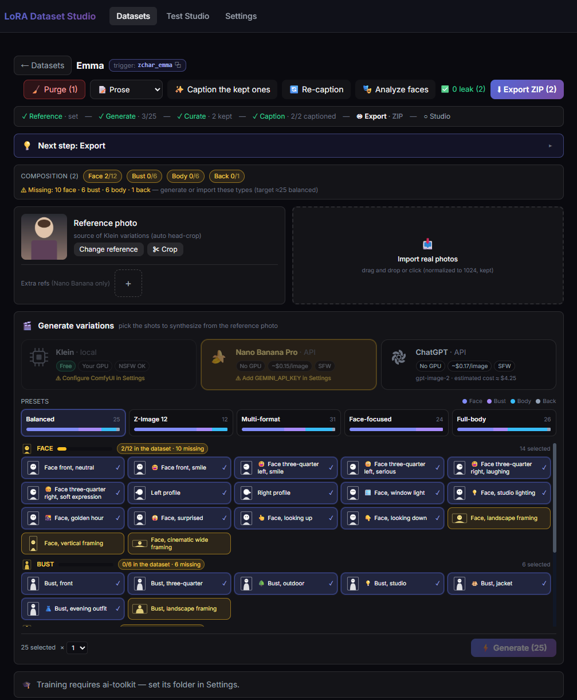
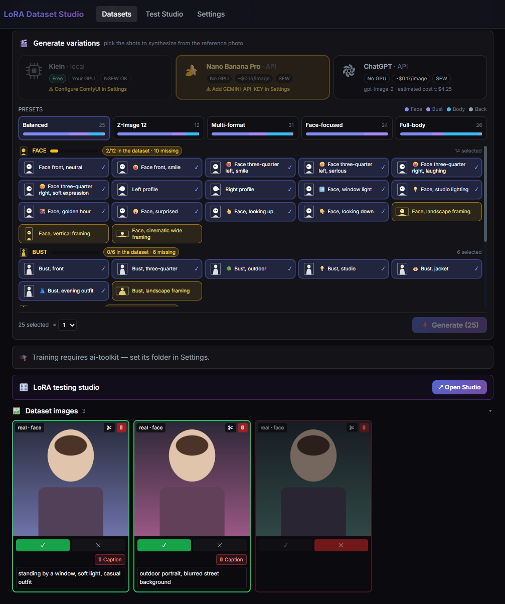
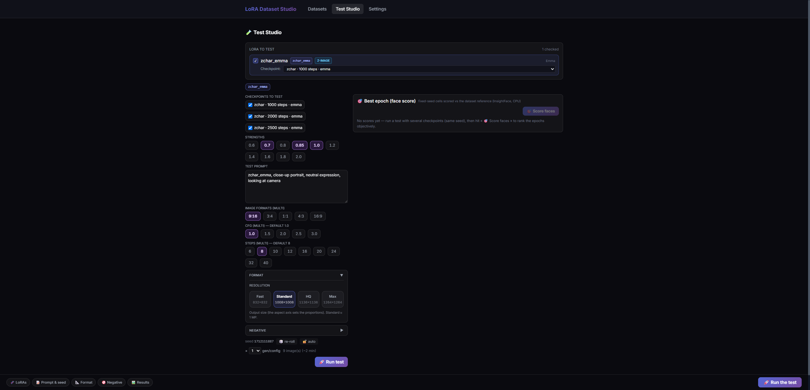

# LoRA Dataset Studio

A single-user, self-hosted workbench for building the dataset that goes into a face/character LoRA — from a single reference photo to a trained, ranked checkpoint — without hand-editing captions or juggling three separate tools.

It exists because the useful part of LoRA training (curating a clean, balanced, well-captioned image set) is normally scattered across a scraper, an image editor, a captioning script, and a training config someone hand-tunes per run. This app puts that whole pipeline behind one UI: generate variations from a reference photo, curate them with a live composition meter, caption them automatically, score them for face fidelity, train a LoRA, and rank the resulting checkpoints — all from a browser tab, on your own machine.

The end-to-end flow:

1. **Create a dataset** — name + trigger word.
2. **Upload a reference photo** (+ up to 3 extra reference images for multi-angle consistency).
3. **Generate variations** via Nano Banana Pro (Gemini), ChatGPT (`gpt-image-2`), or Klein (local ComfyUI).
4. **Import** with automatic head-crop.
5. **Auto-classify framing** (face / bust / body / back) via Ollama vision.
6. **Curate** — keep / reject / crop, guided by a live composition meter targeting 12 face, 6 bust, 6 body, 1 back shot.
7. **Caption** — prose captions for Z-Image, booru-style tags for SDXL, via JoyCaption (ai-toolkit) or Ollama.
8. **Score face similarity** against the reference (InsightFace, configurable green/orange thresholds).
9. **Generate person masks** (rembg) for masked training.
10. **Train a LoRA** via ai-toolkit (Z-Image, SDXL, or Krea 2), with adaptive step counts, a training queue, and scheduling.
11. **Test Studio** — grid-test checkpoint × strength combinations through ComfyUI, vote on outputs, and rank checkpoints by face similarity.
12. **Export** the curated, captioned dataset as a ZIP.

## Why this instead of driving ai-toolkit directly?

"Instead of" is the wrong frame: this app is **not a competitor to [ai-toolkit](https://github.com/ostris/ai-toolkit) — it orchestrates it**. When you click Train, ai-toolkit is the engine running underneath. The real question is whether to drive ai-toolkit through this studio or use it directly (its own UI and config files):

| Stage of the job | ai-toolkit alone | LoRA Dataset Studio |
|---|---|---|
| Build the dataset from one photo | ❌ none — you arrive with your images | ✅ 3-engine fan-out, 36-shot framing catalog, 12/6/6/1 composition target |
| Curate | ❌ your file explorer | ✅ keep/reject, crop, composition meter, **InsightFace scoring** to drop off-identity shots *before* training |
| Captions | ❌ write them yourself | ✅ JoyCaption/Ollama, prose vs booru by family, identity-leak detection |
| Masked training | ⚙️ consumes `mask_path` if you supply masks | ✅ generates rembg masks and writes the config for you |
| Training | ✅ **it is the engine** — full control (rank, lr, optimizer…) | ⚙️ orchestrates: adaptive steps, queue + scheduling, continue +N, auto-import into ComfyUI |
| Pick the best checkpoint | ❌ its sample images + your eye | ✅ Test Studio: checkpoint × strength grids, Wilson-ranked voting, **face-similarity ranking** |

**Honest verdict:** this studio is the better tool when your goal is a **character LoRA built from a single reference photo** — roughly 80% of that job (dataset, curation, captions, epoch selection) happens *outside* training, and that 80% is exactly what ai-toolkit doesn't cover. It is *not* the better tool if you already have prepared datasets and want fine-grained hyperparameter tuning (the studio exposes type/base/variant/steps/masked, not rank or optimizer — use ai-toolkit directly for that), or for anything that isn't an image character LoRA. The two coexist cleanly: the studio's ZIP export is a standard ai-toolkit dataset you can always pick up by hand.

## Feature matrix by backend

Not every feature needs every backend. The app degrades gracefully — API keys show a Configured/Not-set status in Settings, endpoint reachability can be tested via the "Test" button, and gated features simply don't appear until their dependency is satisfied.

| Feature | Requires |
|---|---|
| API image generation (Nano Banana Pro) | `GEMINI_API_KEY` |
| API image generation (ChatGPT / `gpt-image-2`) | `OPENAI_API_KEY` |
| Klein image generation | ComfyUI reachable + Klein model installed |
| Captioning | Ollama **or** ai-toolkit (JoyCaption) |
| Auto-classify framing / auto head-crop | Ollama (vision model) |
| Face-similarity scoring | `backend/requirements-ml.txt` (insightface + onnxruntime) |
| Person masks | `backend/requirements-ml.txt` (rembg) |
| LoRA training | ai-toolkit installed and configured |
| Test Studio (checkpoint testing) | ComfyUI reachable |

## Two run modes

**API-only** — dataset creation, generation via Gemini/ChatGPT, curation, and export. Runs on any machine with Python and no GPU; this is what the Docker image ships. No ComfyUI, no ai-toolkit, no local ML extras required.

**Full local** — everything above plus Klein/Z-Image generation, captioning via JoyCaption, face scoring, masks, training, and Test Studio. Requires ComfyUI and/or ai-toolkit running on the same host (or reachable over the network) and an NVIDIA GPU with 12 GB+ VRAM for Klein/Z-Image inference. Training VRAM depends on the model family (Z-Image, SDXL, and Krea 2 have different footprints) — check the family's ai-toolkit preset before queuing a run. The face-scoring and masking helpers (`requirements-ml.txt`) run fine on CPU; they don't need the GPU.

## External tools (install once, connect in Settings)

None of these are bundled — each one is optional, installed separately, and then simply pointed to from the app's Settings page. Features light up automatically once their tool is detected (the "Test" button next to each field tells you immediately whether the app can see it).

| Tool | Unlocks | Get it |
|---|---|---|
| [ai-toolkit](https://github.com/ostris/ai-toolkit) (Ostris) | LoRA **training**, JoyCaption **captioning** | Follow its README install (clone + its installer creates a `venv`) |
| [ComfyUI](https://github.com/comfyanonymous/ComfyUI) | **Klein** local generation, **Test Studio** | Windows portable build or git install; keep it running on `http://127.0.0.1:8188` |
| [Ollama](https://ollama.com) | Auto-captioning, framing auto-classify, head-crop | Install, then `ollama pull qwen3-vl:8b` (or set your own vision model in Settings) |

**ai-toolkit** — install it anywhere (e.g. `C:\ai-toolkit`), following [its own instructions](https://github.com/ostris/ai-toolkit#installation). This app expects the standard layout its installer produces: `<folder>/run.py` and `<folder>/venv/` (Scripts\python.exe on Windows, bin/python on Linux). Paste the folder path into **Settings → ai-toolkit directory** and hit Test — training and JoyCaption captioning appear once it's valid. Job configs, datasets, and outputs live under that same folder by default (overridable under "Advanced").

**ComfyUI** — this app talks to a running ComfyUI over its HTTP API and scans its `models/` folders to list checkpoints and LoRAs. Set **Settings → ComfyUI API URL** (default `http://127.0.0.1:8188`) and **ComfyUI install directory** (the folder containing `models/`, `output/`, `input/`). Put your Z-Image/SDXL/Krea models under `models/unet` / `models/checkpoints` and trained LoRAs land in `models/loras/<family>` automatically after training.

**Ollama** — used as the lightweight local vision backend. Any vision-capable model works; the default the app looks for is `qwen3-vl:8b`. If you run a different one, set its exact tag in **Settings → Ollama vision model**. If Ollama (or the model) is missing, the app degrades gracefully: imports fall back to a centered crop and captioning falls back to JoyCaption or manual captions.

## Install

### Option 1 — start.bat (Windows, one command)

The repo ships with the frontend prebuilt (`frontend/dist/`), so this doesn't need Node.js:

```
start.bat
```

This creates a `.venv`, installs `backend/requirements.txt`, opens `http://127.0.0.1:5000/` in your browser, and starts the server. Requires Python 3.11+ (the script looks for `py` then `python` on PATH).

### Option 2 — manual venv (any OS)

```bash
python -m venv .venv
source .venv/bin/activate        # Windows: .venv\Scripts\activate
pip install -r backend/requirements.txt
# optional, for face scoring + masks:
pip install -r backend/requirements-ml.txt
python backend/run.py
```

If you need to rebuild the frontend (e.g. you changed something under `frontend/src`):

```bash
cd frontend
npm install
npm run build
```

### Option 3 — Docker (API-only)

Copy `.env.example` to `.env` first — the compose file bind-mounts `./.env`, and Docker will otherwise create an empty directory in its place:

```bash
cp .env.example .env
```

Then build and run:

```bash
docker compose up --build
```

This builds and runs the API-only mode (see `Dockerfile` / `docker-compose.yml`) — ComfyUI and ai-toolkit are host-native tools and out of scope for the container. Data persists to `./data-docker` on the host, and your API keys are mounted in from `.env`.

## Getting API keys

- **Gemini** (for Nano Banana Pro): go to [aistudio.google.com](https://aistudio.google.com), click **Get API key**, and paste it into the app's Settings page.
- **OpenAI** (for ChatGPT / `gpt-image-2`): go to [platform.openai.com](https://platform.openai.com) → **API keys**, create a key, and paste it into Settings.

Both keys are stored in a git-ignored `.env` file (see `.env.example`) — they're never written to `config.json` and never committed.

## Hardware notes

- **API-only**: any machine that runs Python 3.11+. No GPU needed.
- **Local GPU (Klein / Z-Image inference)**: NVIDIA GPU with 12 GB+ VRAM recommended.
- **Training**: VRAM requirements vary by family (Z-Image, SDXL, Krea 2) — check the relevant ai-toolkit job preset before starting a run.
- **Face scoring / masks**: the CPU-only ML extras (`insightface`, `onnxruntime`, `rembg`) don't touch the GPU.

## Configuration reference

Copy `config.example.json` to `config.json` (git-ignored) and adjust. Every key:

| Key | Meaning |
|---|---|
| `server.host` | Interface the Flask server binds to (default `127.0.0.1`, local-only). |
| `server.port` | Port the server listens on (default `5000`). |
| `paths.dataset_images_root` | Where dataset images are stored. Empty string defaults to `<data dir>/datasets`. |
| `comfyui.api_url` | Base URL of your ComfyUI instance (default `http://127.0.0.1:8188`). |
| `comfyui.base_dir` | ComfyUI install directory, used to derive `output`/`input`/`models`/`loras` dirs if those aren't set explicitly. |
| `comfyui.output_dir` | Explicit override for ComfyUI's output folder. |
| `comfyui.input_dir` | Explicit override for ComfyUI's input folder. |
| `comfyui.models_dir` | Explicit override for ComfyUI's models folder (used to scan available checkpoints/UNETs). |
| `comfyui.loras_dir` | Explicit override for ComfyUI's LoRA folder. |
| `ollama.url` | Base URL of your Ollama instance (default `http://127.0.0.1:11434`). |
| `ollama.vision_model` | Ollama vision model used for auto-classify and auto head-crop (default `qwen3-vl:8b`). |
| `aitoolkit.dir` | ai-toolkit install directory. |
| `aitoolkit.datasets_dir` | Override for ai-toolkit's datasets folder (defaults to `<aitoolkit.dir>/datasets`). |
| `aitoolkit.output_dir` | Override for ai-toolkit's output folder (defaults to `<aitoolkit.dir>/output`). |
| `aitoolkit.hf_home` | Override for the Hugging Face cache directory ai-toolkit uses. |
| `engines.default` | Default image-generation engine selected in the UI (`nanobanana`, `chatgpt`, or `klein`). |
| `engines.enabled` | List of engines shown as options in the UI. |
| `captioning.backend` | Caption backend: `auto` (prefer JoyCaption, fall back to Ollama), `joycaption`, `ollama`, or `none`. |
| `training.default_family` | Default model family preselected for new training runs (`zimage`, `sdxl`, or `krea2`). |
| `face_scoring.python` | Python interpreter used to run the InsightFace subprocess (empty = current interpreter). |
| `face_scoring.models_root` | Directory where InsightFace model weights are stored/downloaded. |
| `face_scoring.green` | Similarity score threshold (0–1) above which an image is flagged "green" (strong match). |
| `face_scoring.orange` | Similarity score threshold (0–1) above which an image is flagged "orange" (borderline match). |
| `masks.python` | Python interpreter used to run the rembg subprocess (empty = current interpreter). |
| `klein.consistency_lora` | Filename of the Klein consistency LoRA, relative to ComfyUI's LoRA folder. |
| `klein.consistency_strength` | Strength (0–1) applied to the Klein consistency LoRA. |

Secrets (`GEMINI_API_KEY`, `OPENAI_API_KEY`) live in `.env`, not `config.json` — copy `.env.example` to `.env`, or paste keys into Settings and let the app write them for you.

A few environment variables override paths for advanced/containerized setups: `LDS_DATA_DIR` (runtime data directory), `LDS_CONFIG` (path to `config.json`), `LDS_ENV` (path to `.env`), `LDS_HOST` (bind host, takes priority over `server.host`), `FLASK_DEBUG` (`1` to enable Flask debug mode).

## Known limitations

- Krea 2's img2img workflow (`backend/workflows/krea2_turbo_img2img.json`) ships in the repo but isn't wired into a Test Studio mode yet — only the text-to-image Krea 2 workflow is currently reachable from the UI.
- ComfyUI-dependent code paths (Klein generation, Test Studio, the consistency-LoRA path normalization for Windows ComfyUI) are covered by unit tests against a mocked ComfyUI API; they haven't all been exercised against a live ComfyUI instance yet. If something looks wrong when wiring up your own ComfyUI, check Settings → the "Test" button next to each endpoint.
- The dataset workspace remembers your last-used generator (`localStorage`) and defaults to Nano Banana Pro on a first visit. If you've only configured an OpenAI key, the Nano Banana card shows disabled and the Generate button stays greyed out until you explicitly click the ChatGPT card — a one-click step that's easy to miss right after onboarding.

## Troubleshooting

**`npm install` fails with `Cannot find module @rollup/rollup-<platform>-...`**
A known npm bug ([npm/cli#4828](https://github.com/npm/cli/issues/4828)) can make `package-lock.json` "remember" the platform it was generated on. Fix: run `npm i -D @rollup/rollup-<your-platform>` for your OS/arch, or delete `frontend/node_modules` and `frontend/package-lock.json` and run `npm install` again on the target platform.

**Training log looks frozen for several minutes**
This is normal — ai-toolkit's stdout is block-buffered during model load and latent caching, so nothing prints for a while even though it's working. Check GPU utilization or watch for new files under the ai-toolkit output directory to confirm it's alive; a "warming up" state before the first logged step is expected.

**ComfyUI shows as unreachable**
Check `comfyui.api_url` in Settings, confirm ComfyUI is actually running, and check that nothing (firewall, a different bind interface) is blocking the connection between this app and ComfyUI.

**Port 5000 conflicts with AirPlay Receiver on macOS**
macOS reserves port 5000 for AirPlay Receiver by default. Change `server.port` in `config.json` to something else (e.g. `5050`) and restart.

**Windows console shows garbled characters (mojibake) from `start.bat`**
Cosmetic only — some UTF-8 text (em dashes, accents) renders incorrectly on the legacy Windows console codepage. It doesn't affect functionality.

## Screenshots

Captured from a live run (demo dataset, placeholder art).





## License

MIT — see [LICENSE](LICENSE).
